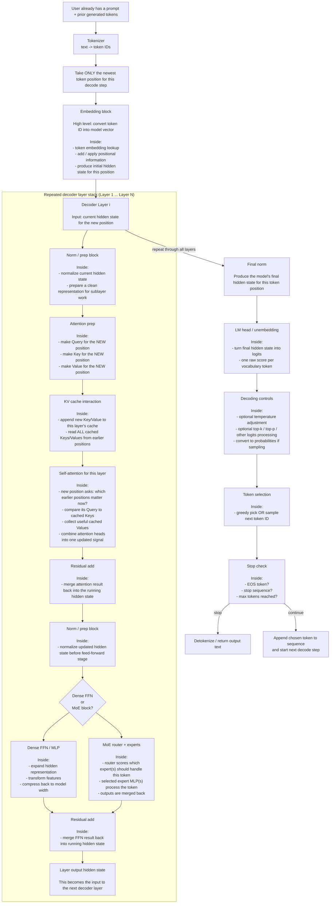
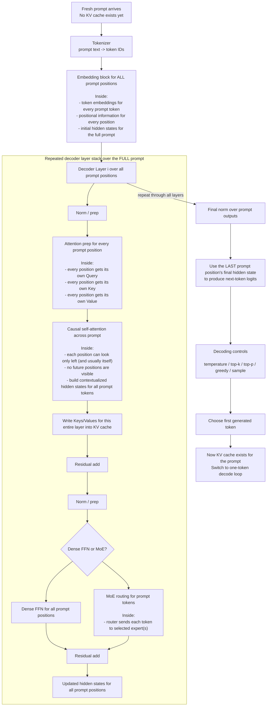

Absolutely — below is a **visual, sequential, “follow one token through the machine” map** that tries to connect the **big blocks** to the **inside-the-block details**, without drowning you in math.

I’m going to assume a **decoder-only causal LLM** (GPT / Llama / Mixtral style), because that’s the architecture used for next-token generation. In that setup, the model predicts the **next token**, can only attend to tokens on the **left**, and usually has a common structure of **token embedding → stack of decoder layers → final normalization → LM head → decoding/sampling**. KV cache is an inference optimization that stores prior keys/values so generation doesn’t recompute them every step. [\[huggingface.co\]](https://huggingface.co/docs/transformers/tasks/language_modeling), [\[deepwiki.com\]](https://deepwiki.com/huggingface/transformers/5.1-causal-language-model-architectures), [\[huggingface.co\]](https://huggingface.co/docs/transformers/kv_cache)

***

# 1) Big-picture mental model

A good way to think about a modern causal LLM is:

1.  **Tokenizer** turns text into token IDs.
2.  **Embedding / position stage** turns those IDs into vectors.
3.  A stack of **decoder layers** repeatedly updates those vectors; each layer’s output is a **hidden state**. Hugging Face’s model outputs describe hidden states as the embedding output plus the output of each layer, which is a good practical definition for “what the model currently thinks this token means right now.” [\[stackoverflow.com\]](https://stackoverflow.com/questions/61323621/how-to-understand-hidden-states-of-the-returns-in-bertmodel), [\[alessiodev....github.io\]](https://alessiodevoto.github.io/LogitLens/)
4.  After the final layer, the model produces **logits** (raw scores for every vocabulary token). Logits are then turned into a probability distribution for choosing the next token. Generation controls such as greedy decoding, top-k, top-p, and other logits processing operate in this **post-logits, pre-token-choice** stage. [\[huggingface.co\]](https://huggingface.co/blog/logits-processor-zoo), [\[discuss.hu...ingface.co\]](https://discuss.huggingface.co/t/stochastic-sampling-with-trainer-evaluate-logits/84965)
5.  If the architecture is **dense**, each decoder layer uses a regular **FFN / MLP** after attention. If the architecture is **MoE**, that FFN region is replaced or augmented by a **router + experts** mechanism that sends each token to one or a few experts. Sparse MoE models activate only a subset of experts per token, which increases capacity without using all parameters every time. [\[arxiv.org\]](https://arxiv.org/abs/2101.03961), [\[research.google\]](https://research.google/blog/mixture-of-experts-with-expert-choice-routing/)

***

# 2) Graph A — **One new token decode step** (KV cache already exists)

This is the graph you’ll want to refer to most often during **generation after the prompt has already been processed**.

***

## How to read Graph A

### **Tokenizer**

The tokenizer is outside the neural network proper. It converts text into discrete IDs. Those IDs are what the model actually consumes. [\[deepwiki.com\]](https://deepwiki.com/huggingface/transformers/5.1-causal-language-model-architectures), [\[huggingface.co\]](https://huggingface.co/docs/transformers/tasks/language_modeling)

### **Embedding block**

This is where the token first becomes a vector the model can manipulate. Positional information is applied here or near here so the model knows **where in the sequence** the token sits. The result is the **initial hidden state** for that token position. Hidden states are simply the model’s internal token representations as they move layer by layer through the network. [\[stackoverflow.com\]](https://stackoverflow.com/questions/61323621/how-to-understand-hidden-states-of-the-returns-in-bertmodel), [\[alessiodev....github.io\]](https://alessiodevoto.github.io/LogitLens/)

### **Decoder layer stack**

Most decoder-only LLMs share the same high-level structure: **token embeddings → stack of decoder layers → final normalization → LM head**. Each decoder layer repeatedly updates the hidden state using **attention** and then **FFN/MLP** (or **MoE experts** in MoE models). [\[deepwiki.com\]](https://deepwiki.com/huggingface/transformers/5.1-causal-language-model-architectures), [\[huggingface.co\]](https://huggingface.co/docs/transformers/tasks/language_modeling)

### **Attention prep (Q/K/V)**

At this step, the current hidden state is projected into three views:

*   **Query** = what this position is looking for now
*   **Key** = how this position advertises what it contains
*   **Value** = the content that gets passed along if attended to

In the cached decode case, the **new token** computes its own Q/K/V for each layer, then compares its **Query** against the **cached Keys** from earlier positions and gathers their **Values**. The main purpose of KV cache is to avoid recomputing earlier keys/values every step. [\[huggingface.co\]](https://huggingface.co/docs/transformers/kv_cache), [\[peterchng.com\]](https://peterchng.com/blog/2024/06/11/what-is-the-transformer-kv-cache/)

### **Residual connections**

These let each sub-block add improvements without fully overwriting the running representation. Intuitively, the hidden state keeps getting refined rather than rebuilt from scratch each time. This is one reason “what the token means right now” becomes richer through depth. [\[alessiodev....github.io\]](https://alessiodevoto.github.io/LogitLens/), [\[stackoverflow.com\]](https://stackoverflow.com/questions/61323621/how-to-understand-hidden-states-of-the-returns-in-bertmodel)

### **Dense FFN vs MoE**

In a **dense** model, every token goes through the same FFN/MLP in every layer. In an **MoE** model, a **router** chooses which expert MLP(s) handle a token, and only that subset is activated. Google’s MoE descriptions and the Switch Transformer paper both frame MoE as conditional computation where only selected experts are used for each token/example. [\[arxiv.org\]](https://arxiv.org/abs/2101.03961), [\[research.google\]](https://research.google/blog/mixture-of-experts-with-expert-choice-routing/)

### **Final norm → LM head → logits**

Once the token reaches the top of the stack, the final hidden state is projected into **logits**, meaning one raw score for each vocabulary item. Hugging Face’s generation material describes logits as the raw, unnormalized scores used to drive token choice. [\[huggingface.co\]](https://huggingface.co/blog/logits-processor-zoo), [\[discuss.hu...ingface.co\]](https://discuss.huggingface.co/t/stochastic-sampling-with-trainer-evaluate-logits/84965)

### **Temperature / top-k / top-p**

These happen **after logits exist and before the final token is chosen**. The clean mental model is:

*   **temperature** changes how sharp or flat the distribution is
*   **top-k** keeps only the k highest-scoring candidates
*   **top-p** keeps the smallest candidate set whose cumulative probability passes p

So temperature is **not** a layer in the network and **not** part of attention; it is a **decode-time control knob** applied to the next-token scores before sampling. Hugging Face’s logits-processing/generation material places this kind of control in the score-processing stage between model output and token selection. [\[huggingface.co\]](https://huggingface.co/blog/logits-processor-zoo), [\[discuss.hu...ingface.co\]](https://discuss.huggingface.co/t/stochastic-sampling-with-trainer-evaluate-logits/84965)

### **What happens when the token reaches the end of the layers?**

Nothing mystical: the model now has its **final hidden state for that position**, uses that to compute **logits**, chooses the next token, appends it, and either **stops** or starts the next decode step. In causal generation, the model predicts the next token from the sequence so far and only attends leftward context. [\[huggingface.co\]](https://huggingface.co/docs/transformers/tasks/language_modeling), [\[huggingface.co\]](https://huggingface.co/docs/transformers/kv_cache)

***

# 3) Graph B — **Prefill / first pass** (there is no KV cache yet)

This is the stage that often causes confusion. When the initial prompt arrives, the model typically processes **the whole prompt sequence** to build the first KV cache. That is different from the later one-token-at-a-time decode loop. Hugging Face describes this as “prefill a cache / prefix caching” and distinguishes it from later cached generation. [\[huggingface.co\]](https://huggingface.co/docs/transformers/kv_cache)

***

## The practical difference between **prefill** and **decode**

*   **Prefill** = process the **entire prompt** so the model can create contextual hidden states and populate KV cache for every layer. [\[huggingface.co\]](https://huggingface.co/docs/transformers/kv_cache), [\[huggingface.co\]](https://huggingface.co/docs/transformers/tasks/language_modeling)
*   **Decode** = generate **one new token at a time**, reusing the cached K/V from the prompt and prior generated tokens. Only the newest position needs fresh work. [\[huggingface.co\]](https://huggingface.co/docs/transformers/kv_cache), [\[peterchng.com\]](https://peterchng.com/blog/2024/06/11/what-is-the-transformer-kv-cache/)

That distinction is the answer to a lot of confusion around *“is it just one token being pushed through the network?”*:

*   **During prefill:** no, conceptually the full prompt is processed.
*   **During later generation:** yes, effectively one new position is processed at a time, but it attends to the cached history. [\[huggingface.co\]](https://huggingface.co/docs/transformers/kv_cache), [\[peterchng.com\]](https://peterchng.com/blog/2024/06/11/what-is-the-transformer-kv-cache/)

***

# 4) The concepts you said you’re unsure about — mapped directly

## **What are “hidden layers” / “hidden states”?**

People often mix these up.

*   A **hidden layer** is one of the repeated internal processing blocks in the stack.
*   A **hidden state** is the vector representation of a token at some point in the network — for example after embeddings, or after layer 7, or after the final layer. Hugging Face’s output docs explicitly describe hidden states as the embedding outputs plus each layer’s outputs. [\[stackoverflow.com\]](https://stackoverflow.com/questions/61323621/how-to-understand-hidden-states-of-the-returns-in-bertmodel), [\[alessiodev....github.io\]](https://alessiodevoto.github.io/LogitLens/)

If you want the simplest possible intuition:

> **A hidden state is “the model’s current internal understanding of this token at this depth.”** [\[alessiodev....github.io\]](https://alessiodevoto.github.io/LogitLens/), [\[stackoverflow.com\]](https://stackoverflow.com/questions/61323621/how-to-understand-hidden-states-of-the-returns-in-bertmodel)

***

## **Where are MoE decisions made?**

Usually **where a normal dense FFN/MLP would sit** inside a decoder layer. Instead of every token going through the same FFN, a **router** scores experts and sends that token to one or a few selected experts. Switch Transformer is a canonical example of this idea; Google’s MoE explainers also describe sparse routing as selecting a subset of experts per token or example. [\[arxiv.org\]](https://arxiv.org/abs/2101.03961), [\[research.google\]](https://research.google/blog/mixture-of-experts-with-expert-choice-routing/)

So in the graph:

*   attention happens first
*   then the model goes into **FFN or MoE**
*   then it returns to the main residual stream and continues upward. [\[arxiv.org\]](https://arxiv.org/abs/2101.03961), [\[deepwiki.com\]](https://deepwiki.com/huggingface/transformers/5.1-causal-language-model-architectures)

***

## **What happens if a token reaches the end of the layers?**

At that point it has a **final hidden state**. The model projects that into **logits**, applies decode controls, chooses a token, and either:

*   stops (EOS / stop sequence / token budget), or
*   appends the token and repeats. [\[huggingface.co\]](https://huggingface.co/blog/logits-processor-zoo), [\[huggingface.co\]](https://huggingface.co/docs/transformers/tasks/language_modeling)

***

## **What does temperature do, and where does it happen?**

It happens in the **decode stage after logits are produced and before sampling picks the next token**. It is best thought of as a **score reshaper**:

*   lower temperature → more conservative / peaked choices
*   higher temperature → flatter distribution / more randomness

It is **not** part of attention, embeddings, FFN, or MoE. It is a **token selection control**. Hugging Face’s generation materials place these sorts of controls in the logits-processing/generation stage after the model emits scores. [\[huggingface.co\]](https://huggingface.co/blog/logits-processor-zoo), [\[discuss.hu...ingface.co\]](https://discuss.huggingface.co/t/stochastic-sampling-with-trainer-evaluate-logits/84965)

***

# 5) The shortest “walkthrough” you can memorize

If you want a compact mental chant for decoder-only LLM generation:

> **Text → tokenize → embed → run through many decoder layers → each layer does attention + FFN/MoE → final hidden state → logits → temperature/sampling → pick token → append token → repeat.** [\[huggingface.co\]](https://huggingface.co/docs/transformers/tasks/language_modeling), [\[deepwiki.com\]](https://deepwiki.com/huggingface/transformers/5.1-causal-language-model-architectures), [\[huggingface.co\]](https://huggingface.co/blog/logits-processor-zoo)

And the cache-specific version is:

> **First do prefill for the whole prompt. Then for each new token, compute only the new position while reusing cached K/V from previous positions.** [\[huggingface.co\]](https://huggingface.co/docs/transformers/kv_cache), [\[peterchng.com\]](https://peterchng.com/blog/2024/06/11/what-is-the-transformer-kv-cache/)

***

# 6) Sources I drew from

I leaned mainly on:

*   Hugging Face docs on **causal language modeling** and **KV cache** for the decode/prefill split and left-to-right generation. [\[huggingface.co\]](https://huggingface.co/docs/transformers/tasks/language_modeling), [\[huggingface.co\]](https://huggingface.co/docs/transformers/kv_cache)
*   Hugging Face / interpretability references for **hidden states** and **logits**. [\[huggingface.co\]](https://huggingface.co/blog/logits-processor-zoo), [\[alessiodev....github.io\]](https://alessiodevoto.github.io/LogitLens/), [\[stackoverflow.com\]](https://stackoverflow.com/questions/61323621/how-to-understand-hidden-states-of-the-returns-in-bertmodel)
*   Google / Switch Transformer references for **MoE routing** and where expert selection lives. [\[arxiv.org\]](https://arxiv.org/abs/2101.03961), [\[research.google\]](https://research.google/blog/mixture-of-experts-with-expert-choice-routing/)
*   A decoder-only architecture summary for the shared high-level block structure. [\[deepwiki.com\]](https://deepwiki.com/huggingface/transformers/5.1-causal-language-model-architectures)

***

If you want, I can do one more thing that would probably help a lot:

### Option A — **“zoomed-in single decoder layer” mermaid**

A separate graph just for **one layer**, showing:

*   residual stream
*   attention heads
*   q/k/v
*   cache read/write
*   dense FFN vs MoE branch

### Option B — **“one concrete example token” walkthrough**

For example:

> prompt = “The capital of France is”\
> and then we trace **how the first generated token** is produced in plain English.

If you want maximum intuition, I’d recommend **both**.
