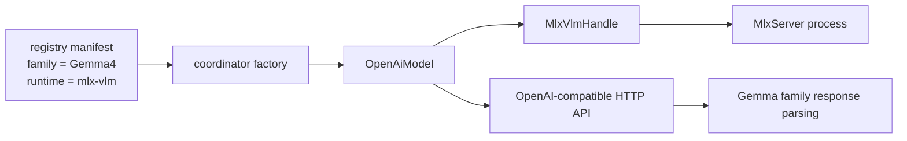

# OpenAI Architecture

The OpenAI path in `nexo-ai` is the generic remote inference backend. It is responsible for talking to any OpenAI-compatible server without baking provider-specific rules into the transport layer.

Today the main concrete provider is `mlx_vlm`, but the architecture is intentionally split so that additional providers can be added without cloning the whole adapter stack.

## Module Split

The remote path is divided into three layers:

| Module | Responsibility |
| --- | --- |
| `openai/protocol.rs` | OpenAI-compatible request and response wire types |
| `openai/client.rs` | HTTP transport for chat and model-list requests |
| `openai/model.rs` | Generic `OpenAiModel<F, S>` runtime adapter |

Provider-specific logic lives outside that layer:

| Module | Responsibility |
| --- | --- |
| `servers/mlx_vlm` | MLX server process lifecycle and health checks |
| `models/gemma4/openai` | Gemma-specific request-model resolution and tool parsing |

## Generic Adapter Model

`OpenAiModel<F, S>` is parameterized over two small interfaces:

- `F: OpenAiFamilyAdapter`
- `S: OpenAiServerControl`

That split is the key architectural boundary.

The family adapter owns:

- the model family name
- request-model resolution
- response interpretation such as tool-call parsing

The server control owns:

- ensuring the remote server is running
- unload behavior for the current provider

## Current Gemma Plus MLX Path

The important part is that MLX-specific process management and Gemma-specific prompt behavior are separate dependencies of the generic adapter, not embedded into it.

## Protocol Layer

`openai/protocol.rs` contains the wire types used across remote backends:

- model listing responses
- chat completion requests
- multimodal content parts
- tool definitions
- tool-call responses
- usage accounting

This file should stay free of provider-specific assumptions.

## Client Layer

`openai/client.rs` is a small transport wrapper over `reqwest`. It currently handles:

- `POST /v1/chat/completions`
- `GET /v1/models`

The client does not know anything about Gemma, MLX, or the coordinator. It just sends and receives typed protocol payloads.

## Family Adapter Layer

`models/gemma4/openai` owns the Gemma-specific parts of the remote path.

That includes:

- `default_request_model_id`, which maps local registry names to the request model id expected by the remote backend
- `Gemma4OpenAiFamily`, which plugs Gemma behavior into the generic `OpenAiModel`
- fallback tool parsing using the same Gemma template used by the Candle path

This is what keeps the Candle and MLX prompt behavior aligned for Gemma 4.

## Server Integration Layer

`servers/mlx_vlm` owns the provider integration details:

- launching `mlx_vlm.server`
- health probing
- model listing
- unload requests
- shared handle management through `MlxVlmHandle`

The coordinator stores the handle, and the generic OpenAI model only depends on the `OpenAiServerControl` interface.

## Why This Split Is Better

This refactor removes two earlier architecture problems:

- generic OpenAI code no longer depends directly on `MlxServer`
- Gemma-specific remote behavior no longer lives in a generic transport namespace

That makes the remote path easier to extend. Adding a new provider should mostly mean:

1. implement a new server integration in `src/servers`
2. add or reuse a family adapter in `models/<family>/openai`
3. register the new runtime in the registry
4. add the new `(family, runtime)` branch in the coordinator factory

## Practical Outcome

The user-visible effect is simple:

- `list` can show `gemma4` as the family and `mlx-vlm` as the backend
- the loader can create the correct adapter without fake family names
- shared prompt formatting stays owned by the family, not duplicated across backends
