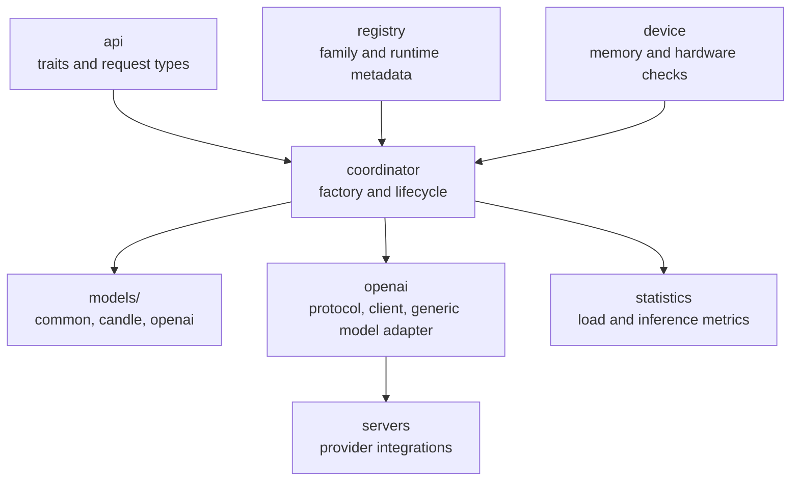
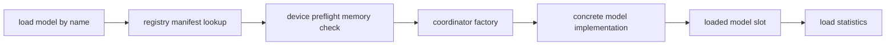
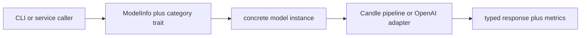

# Architecture

The `nexo-ai` crate is structured as a small set of stable layers:

- a trait and type API at the top
- a registry that describes what exists
- a coordinator that decides what to load
- backend-specific model code that does the actual inference

The main refactor goal was to make family ownership and backend ownership explicit. Generic OpenAI logic now lives in one place, provider-specific server logic lives in one place, and each model family owns its own prompting and backend adapters.

## Layer Overview



## Top-Level Responsibilities

### `src/api`

This is the stable runtime contract. It contains:

- `model_traits.rs` for `ModelInfo` and category traits
- `types.rs` for all request and response types
- `lora_traits.rs` for adapter-capable model surfaces

Everything else in the crate is built to satisfy these interfaces.

### `src/registry`

The registry is static metadata, not executable model logic.

Each `AiModelManifest` now carries:

- download files and sizes
- supported categories
- `ModelFamily`
- `ModelRuntime`

That makes the registry the single source of truth for both user-facing model listing and runtime dispatch.

### `src/coordinator`

The coordinator owns runtime state:

- loaded model slots
- active model selections per category
- configuration overrides
- load and unload policy
- the model factory used to instantiate concrete implementations

The important change here is that creation now dispatches from explicit `(family, runtime)` metadata instead of matching on ad hoc manifest strings.

### `src/models`

Each model family owns its own layout. The standard target shape is:

```text
models/<family>/
├── common/
├── candle/
└── openai/
```

Not every family implements every backend. Empty backend folders are acceptable if they keep the family layout predictable.

### `src/openai`

This module is intentionally generic. It contains:

- protocol types for OpenAI-compatible APIs
- a reusable HTTP client
- a generic `OpenAiModel<F, S>` adapter

It does not own Gemma-specific prompting or MLX-specific process management.

### `src/servers`

This module owns provider integration details, such as:

- process startup
- health checks
- model listing
- unload hooks

Today that mainly means the `mlx_vlm` integration.

## Load Path

This is the current load path for every model:



The factory decision is driven by the manifest. That keeps download metadata, list output, and loader behavior aligned.

## Request Path

Once a model is loaded, request handling is intentionally boring:



The caller does not need to know whether the implementation is local or remote.

## Shared Support Code

`models/support` holds cross-family helpers that do not belong to one family. Two examples are important:

- `prompting.rs` for shared chat-template abstractions
- `conversation.rs` for CLI conversation management

The Candle-only tensor and weight helpers also live under `models/support`, but they stay behind the `candle` feature.

## Why The Split Matters

This layout fixes a few real problems from the previous structure:

- generic OpenAI code is no longer mixed with MLX-specific code
- Gemma 4 owns its prompt formatting for both Candle and MLX paths
- backend names are no longer treated as model families
- dead compatibility namespaces such as `shared` and `remote_models` are gone

## Backend-Specific Docs

- `Candle Architecture` covers the local runtime path
- `OpenAI Architecture` covers the generic OpenAI adapter and MLX provider integration
