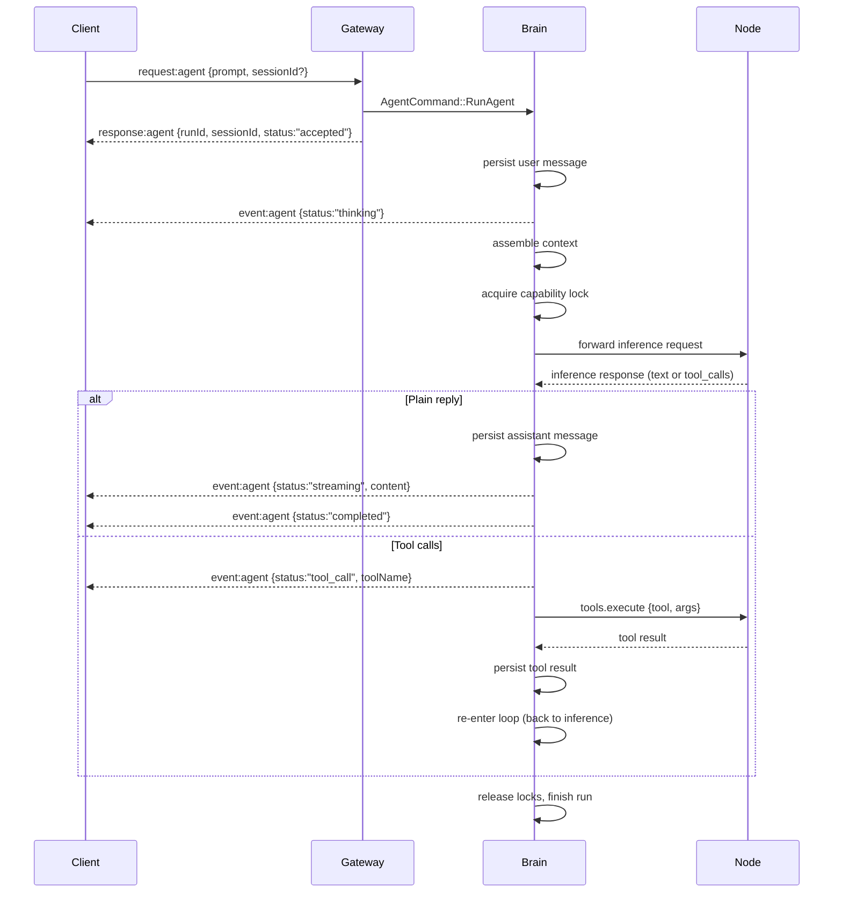
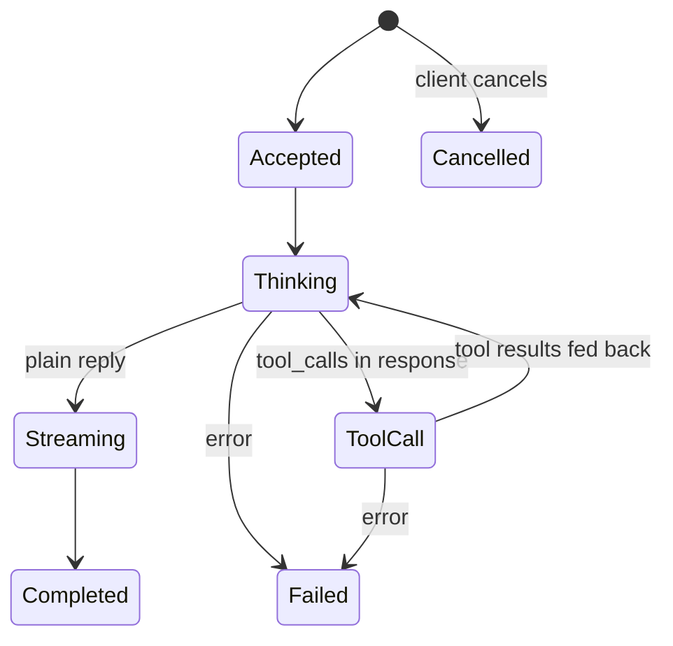
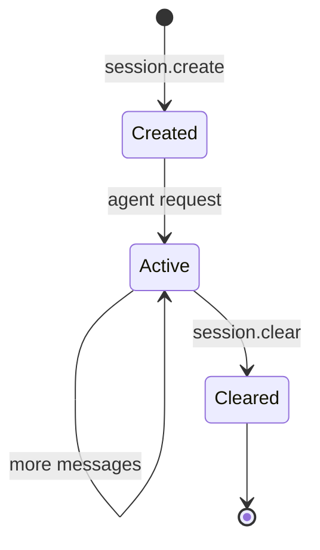

# Agent Loop

The agent loop is the brain of the NEXO system. It receives structured requests from
the gateway WebSocket, orchestrates inference and tool execution, and streams lifecycle
events back to the client.

## Overview

Each agent invocation spawns a **serialized loop** bound to a session. The loop:

1. Persists the user message
2. Assembles conversation context from the session's message history
3. Forwards an inference request to an LLM-capable node
4. Handles the response — either streaming a reply or executing tool calls
5. Repeats (tool results feed back into the next inference turn)
6. Marks the run as completed or failed

## Agent loop lifecycle

## Agent run state machine

### Status values

| Status | Description |
|--------|-------------|
| `accepted` | Run created, queued for processing |
| `thinking` | Assembling context and waiting for inference |
| `tool_call` | Model requested a tool execution |
| `streaming` | Model is generating a reply |
| `completed` | Run finished successfully |
| `failed` | Run encountered an error |
| `cancelled` | Run was cancelled by the client |

## Sessions

Sessions are persistent conversation containers. A client can:

- **Create** a session explicitly via `session.create`, or let the gateway auto-create
  one when sending an `agent` request without a `sessionId`.
- **List** active sessions via `session.list` (returns message counts and timestamps).
- **Retrieve** a session's full message history via `session.get`.
- **Clear** a session and all its data via `session.clear`.

Sessions persist across client reconnections. A client stores the `sessionId` locally
and provides it in subsequent `agent` requests to maintain conversational context.

## Capability locking

When the agent loop invokes a node capability (e.g. LLM inference or a tool), it
acquires an advisory lock in SQLite:

- **Acquire**: `INSERT OR IGNORE` on the `capability_locks` table with a 5-minute expiry.
- **Release**: `DELETE` after the operation completes.
- **Expiry**: Locks older than their `expires_at` are automatically reaped.

This prevents two concurrent agent runs from using the same capability simultaneously,
ensuring consistent tool/model access across the distributed node network.

## Cron jobs

Cron jobs are scheduled agent tasks stored in the database. Each job specifies:

- A **schedule** (cron expression)
- A **prompt** (what the agent should do)
- An optional **session_id** (to continue a conversation)

The cron scheduler runs as a background task, polling every 60 seconds for due jobs.
When a job fires, it submits an `AgentCommand` to the brain and emits a `cron` event.

## Context assembly

Before each inference call, the brain loads the full conversation history from the
`messages` table for the current session, ordered chronologically. It also builds a
system prompt that describes the available tools, enabling the LLM to make tool calls.

The context window includes messages with roles:
- `user` — user prompts
- `assistant` — model responses
- `tool` — tool execution results
- `system` — context injections
