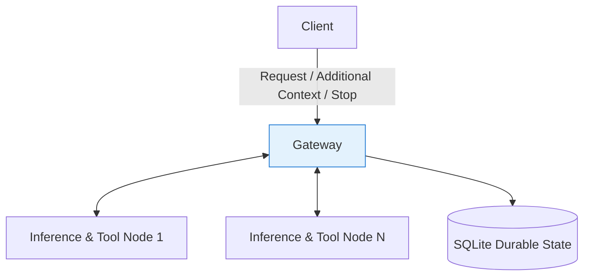
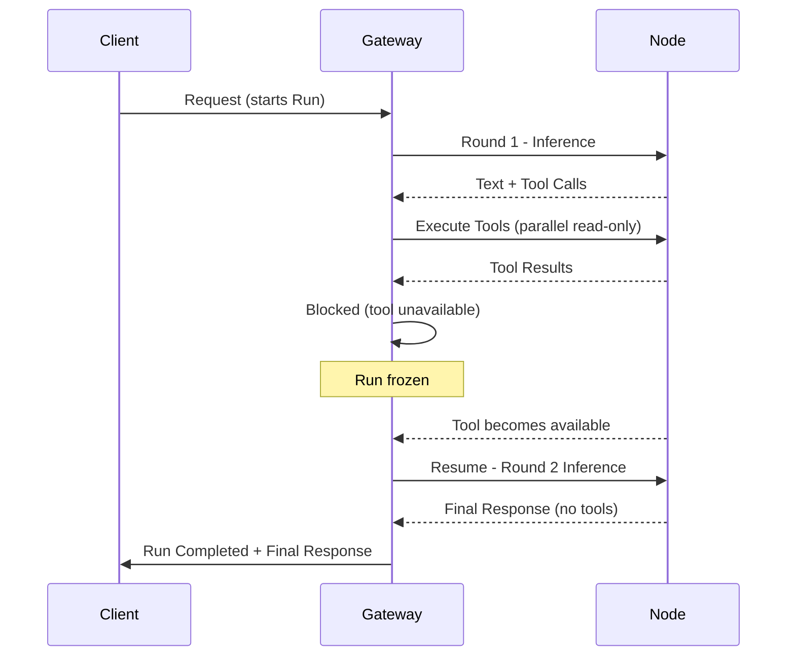
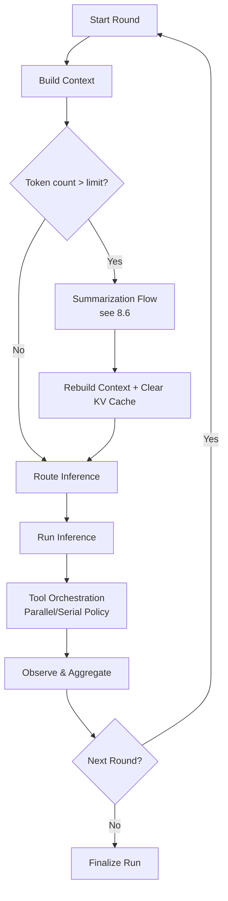
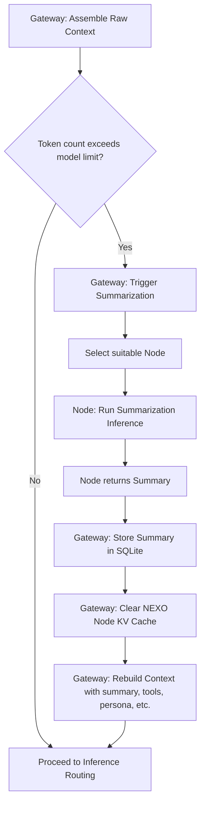

# NEXO Run Loop Architecture

## 1. Scope

This document specifies the NEXO run loop at the level of three actors: **Client**, **Gateway**, and **Node**. It describes how runs are coordinated, how inference and tools are orchestrated, and how progress is tracked. Transport-layer concerns (connection management, authentication, retries, message framing, delivery semantics) are out of scope.

***

## 2. Actors and Responsibilities

### 2.1 Client

The client initiates and steers a run, and consumes streamed progress and results.

**Responsibilities**

* Submit a user **request** that starts a **Run**.
* Provide optional additional context (messages/files) during an active run; this context is queued for the next round.
* Issue a run-level **Stop** request to cancel ongoing work.
* Display incremental progress (status events), intermediate model output, tool activity, and the final response.

### 2.2 Gateway

The gateway is the authoritative coordinator and state holder for the run loop.

**Responsibilities**

* The gateway **MUST** maintain durable state for users, sessions, runs, rounds, tool traces, per-round rationale, and summaries in SQLite.
* The gateway **MUST** assemble context for inference, including: agent persona and instructions, session transcript, retrieved memory (associated to user/session/tool/run), tool inventory and tool schemas, skills and other deterministic metadata.
* The gateway **MUST** route each **Round** to an appropriate node for inference based on: requested thinking effort (client hint), availability/capabilities (models, tools), token budgets for remote models, and performance hints (including KV-cache affinity).
* The gateway **MUST** interpret model output (mixed text + tool calls).
* The gateway **MUST** validate and authorize tool calls.
* The gateway **MUST** dispatch tool calls to nodes that provide the requested tools.
* The gateway **MUST** coordinate tool execution ordering and parallelism using deterministic rules.
* The gateway **MUST** freeze the run when required tools are unavailable; it **MUST** resume when tools become available.
* The gateway **MUST** enforce stopping conditions (max rounds, time budget, token budget for remote models, repeated failures, user cancel).
* The gateway **MUST** emit status events and stream intermediate outputs for client visibility and steering.
* The gateway **MUST** emit the final response when the run terminates.

**Key internal components (conceptual)**

* **Context Builder**: deterministic prompt/context assembly (MUST include optional summarization when token limits are exceeded).
* **Router**: round-level node selection + parallelism decisions + budget enforcement.
* **Tool Orchestrator**: tool validation, dispatch, aggregation, deduplication, retry policy.

### 2.3 Node

Nodes execute inference and tools. Nodes are not authoritative and do not hold durable run state.

**Responsibilities**

* A node **MUST** run exactly one inference per round when selected by the gateway.
* A node **MUST** execute deterministic tools when selected by the gateway.
* A node **MUST** validate tool arguments and enforce tool schemas locally (in addition to gateway validation).
* A node **MUST** return tool results in tool-specific, explicitly defined formats shared with the gateway.
* A node **MUST** maintain only ephemeral in-memory state: KV caching (performance optimization) and tool-specific in-memory state as needed for execution.

***

## 3. Core Concepts and Data Model

### 3.1 Terminology

* **Request**: One client submission that starts (or augments) a **Run**.
* **Run**: A full run loop execution for a single request, consisting of one or more rounds.
* **Round**: One cycle of context assembly → single inference → tool orchestration (0..n tools) → observation/aggregation → next decision.

### 3.2 Run Record (Gateway-owned)

A run **MUST** persist:

* Run id, user id, session id
* Status (active, blocked, stopped, failed, completed)
* Round list
* Transcript (user messages, model outputs, tool calls, tool results)
* Per-round rationale (model-provided)
* Stored summaries (when summarization has occurred)

***

## 4. Run Loop Execution

### 4.1 High-Level Round Structure

Each round **MUST** be executed by the gateway as follows:

1. **Build Context**  
   * Gather persona/instructions, transcript, memory, tool inventory, and skills.  
   * The gateway **MUST** calculate the token count of the assembled context using the selected model’s tokenizer.  
   * If the token count exceeds the model’s context window limit, the gateway **MUST** trigger summarization (see section 8.6). The resulting summary **MUST** be stored in SQLite. The gateway **MUST** then rebuild the full context (including the summary, current tool list, system prompt, etc.). The NEXO node KV cache **MUST** be cleared before the next inference.

2. **Route Inference**  
   * Select an inference node based on per-round routing policy (effort hint, budgets, model/tool availability, cache affinity).

3. **Run Inference (Exactly One per Round)**  
   * Node returns: text output (optional), per-round rationale, zero or more tool calls (possibly annotated with parallel/sequential hints).

4. **Tool Orchestration**  
   * Validate tool calls (schema, permissions).  
   * Determine execution plan using the following deterministic policy (MUST be enforced):  
     * Read-only tools **MAY** always be parallelized.  
     * Tools with side effects **MUST** be executed sequentially unless explicitly annotated as parallel-safe.  
   * Dispatch tool calls to nodes where tools are available.  
   * If a required tool is unavailable, transition the run to **Blocked** and freeze until availability changes or the run is canceled.

5. **Observe and Aggregate**  
   * Collect tool results and append to transcript.  
   * Determine next step: start next round, or finalize the run.

### 4.2 Tool Calls per Inference

A single inference response **MAY** request multiple tools. The gateway:

* Accepts mixed text + tool calls.
* Applies the deterministic parallelism policy defined in 4.1.
* Maintains a state machine that supports deduplication and controlled retries.

### 4.3 Handling Additional Context Mid-Run

* Additional client context **MUST** be queued and applied at the start of the next round.
* A client-issued **Stop** request is run-scoped and causes the gateway to attempt cancellation of in-progress inference or tool calls.

***

## 5. Termination and Completion Semantics

### 5.1 Completion

A run **MUST** complete when:

* The latest inference returns no tool calls and emits a final response, and
* No other stop condition has triggered.

Premature completion is acceptable; the client **MAY** initiate a new request with follow-up instructions.

### 5.2 Blocking on Tool Availability

If a required tool is unavailable:

* The run **MUST** transition to **Blocked**.
* The gateway **MUST** freeze progress (no further inference) until the tool becomes available, the client cancels, or the session is cleared.

### 5.3 Stop Conditions

The gateway **MUST** stop a run due to any of the following:

* Maximum rounds reached
* Time budget exceeded
* Token budget exceeded (remote/frontier models)
* Repeated failures
* Client stop request

***

## 6. Routing and KV Cache Strategy

### 6.1 Per-Round Routing

Routing **MUST** be decided per round by the gateway router component using:

* Requested thinking effort (client hint)
* Model availability and tool availability across nodes
* Token budget constraints for remote models
* Performance hints (including affinity to nodes with existing session KV cache)

### 6.2 KV Cache Handling

* KV cache is treated as a performance optimization keyed per user+session.
* Nodes **MAY** rebuild KV cache by receiving the full prompt prefix for the session from the gateway.
* When summarization occurs, the associated KV cache on the selected node **MUST** be cleared; the next inference starts with the newly rebuilt context.
* Tool inventory is versioned; if a run depends on a tool version that is no longer available, the run **MUST** fail and the client **MUST** be notified.

***

## 7. Observability and Progress Reporting (Conceptual)

The gateway **MUST** emit progress events and streamed outputs for:

* run lifecycle (started, finished)
* round lifecycle (started, finished)
* inference status (thinking, intermediate output)
* tool activity (tool called, tool result)
* blocked state (waiting for tool availability)

The exact transport mechanism is defined elsewhere.

***

## 8. Mermaid Diagrams

### 8.1 Component Architecture (Static View)

### 8.2 Sequence Diagram (One Run with Multi-Tool Dispatch and Blocking)

### 8.4 Activity/Flow Diagram (Round Algorithm Detail)

### 8.6 Summarization Flow

### 9. Open Decisions (Explicitly Deferred)
The following items are acknowledged but not finalized:
* Detailed resource-locking strategy for mutating/destructive tools (beyond the parallel/sequential policy already defined).
* Exact model context-window targets for local inference (the architecture supports token-based summarization regardless).

### 10. Summary

NEXO is a gateway-centric run loop where the gateway owns durable state, per-round routing, tool orchestration and context window management. Nodes provide inference and tools with shared schemas but remain ephemeral and replaceable. Each round performs exactly one inference, applies a clear read-only vs. side-effect parallelism policy, and iterates until termination conditions are met or execution becomes blocked awaiting tool availability.

