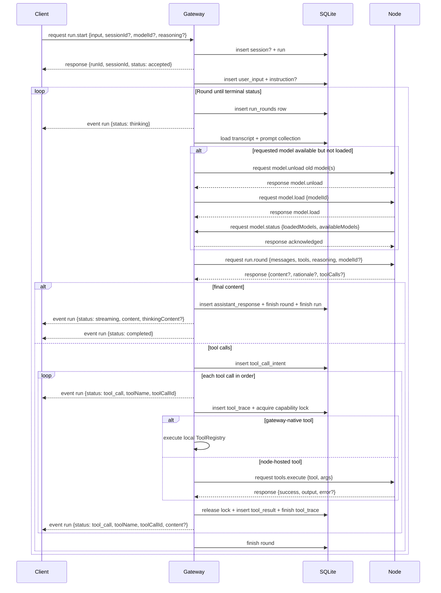
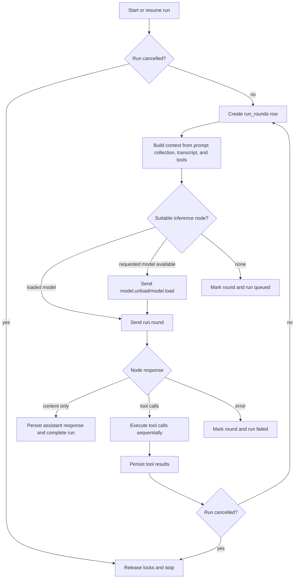
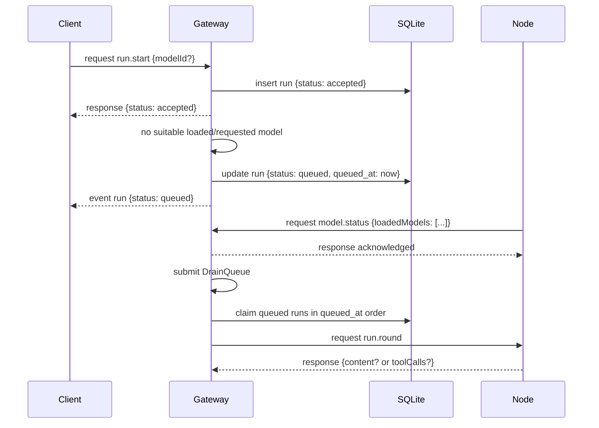

# NEXO Run Loop Architecture

## 1. Scope

This document describes the current NEXO run loop and the selected planned contracts
that should remain visible for later implementation. Current behavior is stated as
current behavior. Planned behavior is isolated in section 7 and should not be read as
implemented yet.

Transport details such as HTTP upgrade auth, frame envelopes, protocol versioning,
and connect handshakes are defined in the gateway protocol documentation.

## 2. Actors

### 2.1 Client

The client starts and steers runs, then consumes run events.

Current responsibilities:

* A client **MUST** connect to the gateway with `role: "user"` before sending other
    requests.
* A client **MAY** create or resume a session with `session.create`, `session.list`,
    and `session.get`.
* A client **MUST** start a run with `run.start`; the gateway responds once the run
    has been durably accepted, not when inference has finished.
* A client **MAY** append structured instructions to an active run with
    `run.instructions.append`; those instructions are persisted and observed by the
    next round that rebuilds context.
* A client **MAY** cancel an active run with `run.stop`. Cancellation is currently
    cooperative: the gateway marks the run cancelled and the run loop checks that state
    between local phases.
* A client consumes `run` events for `thinking`, `tool_call`, `streaming`,
    `completed`, `failed`, `queued`, and `cancelled` statuses.

### 2.2 Gateway

The gateway is the authoritative run coordinator and durable state owner. The Rust
module namespace is still `agent`, but the public protocol and database model are
run/round based.

Current responsibilities:

* The gateway **MUST** maintain durable SQLite state for devices, users, sessions,
    runs, run rounds, conversation entries, tool traces, run summaries, capability
    locks, and cron jobs.
* The gateway **MUST** treat the connecting user's `client.id` as the current user
    routing identity for sessions and directed messages.
* The gateway **MUST** assemble model-facing context from the selected prompt
    collection, persisted session transcript, and currently available tool inventory.
* The gateway **MUST** route each inference round to a connected node with a loaded
    compatible model, or to a node that has the explicitly requested model available
    and can receive `model.load`.
* The gateway **MUST** queue a run when no suitable LLM node is available.
* The gateway **MUST** parse node `run.round` responses into either a final assistant
    reply or one or more tool calls.
* The gateway **MUST** execute gateway-native tools before forwarding unknown tools to
    node-hosted tools.
* The gateway **MUST** persist tool-call intent, tool traces, tool results, assistant
    replies, per-round rationale, and terminal run summaries.
* The gateway **MUST** release all capability locks held by a run when that run
    completes, fails, or is cancelled.
* The gateway **MUST** emit run lifecycle and tool activity events through the shared
    event channel.

### 2.3 Node

Nodes provide inference and tools. Nodes are not authoritative for run state.

Current responsibilities:

* A node **MUST** connect to the same gateway WebSocket endpoint with `role: "node"`.
* A node **MUST** advertise locally available model IDs during `connect` and publish
    loaded model descriptors with `model.status`.
* A node **MUST** register full `nexo-core` tool definitions with `tools.register`
    after handshake.
* A node **MUST** execute `tools.execute` requests against its local `ToolRegistry`.
* A node **MUST** handle gateway-directed `model.load` and `model.unload` requests.
* A node **MUST** handle `run.round` by converting the request into a `nexo-core`
    `InferenceRequest` and submitting it to `nexo-ai`.
* A node currently allows only one concurrent inference-class request
    (`run.round` or `image.analyze`). If busy, it returns a `node_busy` error.
* A node **MAY** reconnect after disconnect; on reconnect it must repeat handshake,
    tool registration, and model status publication.

### 2.4 Local Inference Runtime

`nexo-ai` is a library runtime used by `nexo-node`. It adapts `nexo-core` inference
contracts to `mistralrs-core`, resolves models through a static registry, maps
reasoning/tool settings to the underlying runtime, and streams normalized
`InferenceResponse` values back to the node transport layer.

## 3. Core Concepts

* **Request**: a client submission that starts or modifies work, such as `run.start`
    or `run.instructions.append`.
* **Run**: one gateway-owned execution for a user input. A run belongs to one
    session and contains one or more rounds.
* **Round**: one context assembly -> inference -> optional tool execution cycle.
* **Conversation entry**: a durable transcript row. Current entry kinds are
    `user_input`, `instruction`, `assistant_response`, `tool_call_intent`, and
    `tool_result`.
* **Tool trace**: a durable record of one tool call's arguments, status, output, and
    error.

Current wire run statuses are `accepted`, `queued`, `thinking`, `tool_call`,
`streaming`, `completed`, `failed`, and `cancelled`. Current round database statuses
are `started`, `completed`, `failed`, `queued`, and `cancelled`.

## 4. Current Execution

### 4.1 Start

When the gateway handles `run.start`:

1. It resolves the user ID from the connected peer's `client.id`.
2. It creates a session when no `sessionId` was supplied, otherwise it reads the
     existing session's `prompt_collection_id`.
3. It creates a row in `runs` with the idempotency key, optional model ID, and typed
     `ReasoningSettings`.
4. It submits `RunCommand::StartRun` to a single background `RunHandle` task.
5. It returns `RunStartResponse { status: accepted }` to the client.

The background task processes run commands sequentially. This currently serializes
run execution inside one gateway process.

### 4.2 Context Assembly

At the start of each round, the gateway builds a `Vec<ConversationMessage>` for the
node:

1. It loads all persisted conversation entries for the session in chronological order.
2. It loads the selected prompt collection from git-backed `PROMPTS/collections.json`
     and concatenates the referenced prompt documents from `PROMPTS/`.
3. It appends a generated `# Available Tools` section containing currently available
     gateway and node tool definitions.
4. It creates a system message from the prompt collection plus tool section. If both
     are empty, it uses `You are a helpful assistant.`.
5. It prepends that system message to the persisted conversation messages.

The current context builder does not yet retrieve memory, load skills, count tokens,
or summarize over-limit transcripts.

### 4.3 Routing and Model Loading

Current routing is intentionally simple:

* If `run.start` specified `modelId`, the gateway first looks for a connected node
    with that model already loaded.
* If no node has it loaded, the gateway looks for a connected node that advertised the
    model as available on disk.
* If the model is available but not loaded, the gateway asks that node to unload other
    loaded models, then sends `model.load` and waits up to 300 seconds.
* If no `modelId` was specified, the gateway selects the first connected node with a
    loaded model that advertises text-generation or tool-calling capability.
* If no suitable node exists, the round is marked queued and the run status becomes
    `queued`.

Queued runs are resumed by `RunCommand::DrainQueue`, which is submitted when a node
publishes a `model.status` update containing at least one loaded model.

### 4.4 Inference

For each round, the gateway sends one `run.round` request to the selected node. The
payload contains the run ID, round ID, session ID, assembled messages, available tool
definitions, optional model ID, and typed reasoning settings.

The node maps the request into a `nexo-core` `GenerateRequest`:

* Text generation is required.
* Tool calling is preferred when tools were provided.
* Tool choice is `Automatic` when tools exist and `Disabled` otherwise.
* Reasoning settings are forwarded to `mistralrs-core` as thinking and effort hints.
* Streaming is currently buffered at the node transport boundary.

The node returns a `RunRoundResponse` with optional visible content, optional
`rationale`, and zero or more tool calls.

### 4.5 Replies, Rationale, and Thinking Content

If the node returns visible content and no tool calls, the gateway:

1. Persists the visible content as an `assistant_response` conversation entry.
2. Stores node-provided rationale in `run_rounds.rationale`.
3. Emits a `streaming` run event with the visible content and optional
     `thinkingContent` copied from rationale.
4. Emits a `completed` run event.
5. Marks the run `completed` and stores the final response in `run_summaries`.

Rationale is not written into the conversation transcript as assistant-visible text.
It is stored per round and emitted ephemerally for clients that display thinking
content.

### 4.6 Tool Calls

If the node returns tool calls, the gateway:

1. Persists the assistant tool-call plan as `tool_call_intent`.
2. Executes tool calls sequentially in the order returned by the model.
3. For each call, creates a `tool_traces` row and emits a `tool_call` run event.
4. Acquires an advisory capability lock based on the prefix before the first `.` in
     the tool name.
5. Executes gateway-native tools first. If no gateway tool matches, it forwards
     `tools.execute` to the node that registered the tool.
6. Releases the capability lock after the tool returns.
7. Persists the result as a `tool_result` conversation entry, updates the tool trace,
     and emits another `tool_call` run event carrying the result fields.
8. Completes the round and starts the next round.

If a capability lock is busy, the gateway records an error-shaped tool result and
continues. If a tool is missing or its node is disconnected, the current implementation
records a failed tool result or fails the forwarded request path; it does not yet enter
a blocked/resumable state.

### 4.7 Stop Conditions

Current stop conditions are:

* Final assistant reply with no tool calls.
* Inference or context assembly error.
* No suitable LLM node, which queues the run instead of failing it.
* Cooperative cancellation via `run.stop`.
* Maximum round count exceeded. The current limit is 20 rounds.

The current implementation does not enforce wall-clock budgets, remote token budgets,
or repeated-failure thresholds beyond ordinary error handling.

### 4.8 Cron Runs

The gateway runs a background cron scheduler every 60 seconds. When a due job fires,
the scheduler emits a `cron` event, creates or resolves a session, creates a run with
thinking disabled, and submits `RunCommand::StartRun` to the same background run task.

## 5. Current Diagrams

### 5.1 One Run with Tools

### 5.2 Current Round Algorithm

### 5.3 Queued Run Resume

## 6. Current State That Replaced Older Notes

These points were useful in the archived loop note and are now part of the active
contract:

* The public surface is `run.start`, `run.stop`, `run.instructions.append`,
    `run.round`, `run` events, sessions, prompt collections, runs, and run rounds.
* Prompt documents live under `PROMPTS/`; prompt collection metadata lives in
    `PROMPTS/collections.json` as a bare JSON array.
* Gateway-native tools currently include notes and IO tools registered at startup.
    They appear in `tools.catalog` with `source: "gateway"` and execute before node
    forwarding.
* Queued runs preserve model ID, prompt collection, and typed reasoning settings when
    drained.
* Thinking mode is represented by `ReasoningSettings`, not by injecting a hard-coded
    model-specific token into the system prompt.

## 7. Selected Planned Contracts

The following blocks are intentionally retained as future requirements. They are not
fully implemented in the current code.

### 7.1 Token Counting and Summarization

The context builder **MUST** calculate assembled context size with the selected
model's tokenizer before inference. If the context exceeds the model window, the
gateway **MUST** summarize older transcript material, store the summary in SQLite,
rebuild context with the summary and current tools, and clear the relevant node-side
KV/prefix cache before the next inference.

### 7.2 Retrieved Memory and Skills

The context builder **MUST** support deterministic inclusion of retrieved memory and
skills associated with the user, session, run, tool, or project. These inputs should
be auditable, ordered, and visible in persisted run metadata or traces.

### 7.3 Budget and KV-Affinity Routing

The router **MUST** eventually choose nodes per round using requested reasoning effort,
model capabilities, tool availability, remote token budgets, time budgets, and
performance hints such as session KV-cache affinity.

### 7.4 Parallel Tool Scheduler

The tool orchestrator **MUST** use `ToolExecutionConstraints` when planning multiple
tool calls from one inference:

* Read-only tools **MAY** run in parallel.
* Side-effecting tools **MUST** run sequentially unless explicitly marked parallel-safe.
* Tool timeouts **MUST** honor each tool definition's configured timeout when present.

The current implementation executes all tool calls sequentially and uses an advisory
capability lock for every tool call.

### 7.5 Blocked Tool Resume

If a required tool is unavailable, the run **MUST** be able to transition to a blocked
state, freeze without further inference, and resume when the tool becomes available or
the user cancels the run. Implementing this requires a wire/database status that is
distinct from the current `queued` LLM-availability state.

### 7.6 Tool Authorization and Versioning

The gateway **MUST** validate tool calls against schemas, permissions, and tool
contract versions before dispatch. If a run depends on a tool version that is no
longer available, the gateway **MUST** fail or block the run with a client-visible
reason instead of silently using a different contract.

## 8. Open Decisions

* `run.stop` currently cancels cooperatively in the gateway database; there is no
    gateway-to-node cancellation request for in-flight inference.
* A general idempotency table exists, and run IDs are protected by a unique
    idempotency key, but request replay/dedupe behavior is not yet implemented for all
    side-effecting methods.
* `nexo-core` has richer run/round lifecycle types than the current WebSocket
    `RunStatus`; these should converge when blocked runs and detailed round events are
    added.

