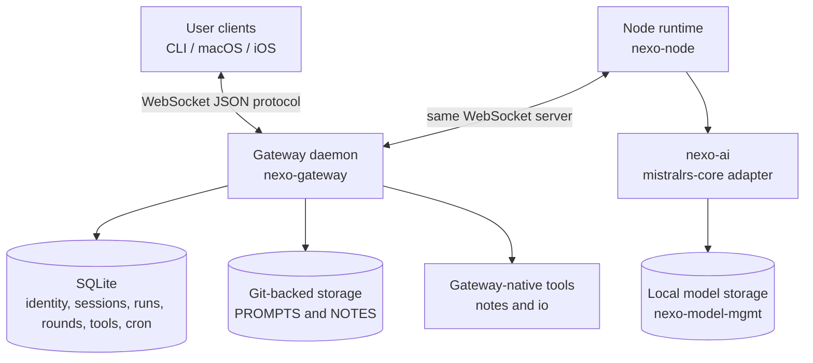
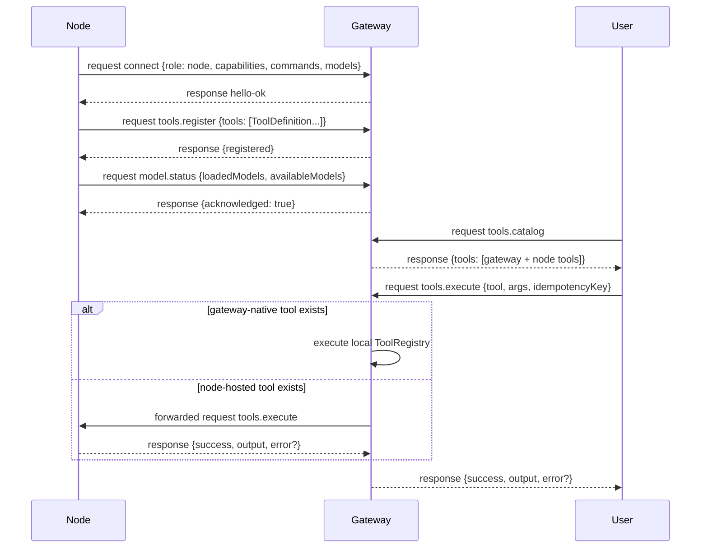
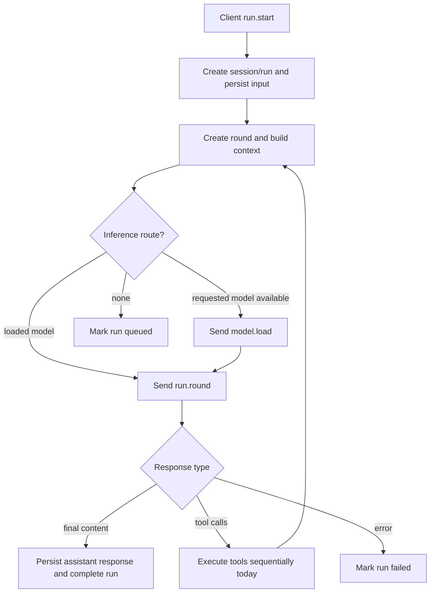
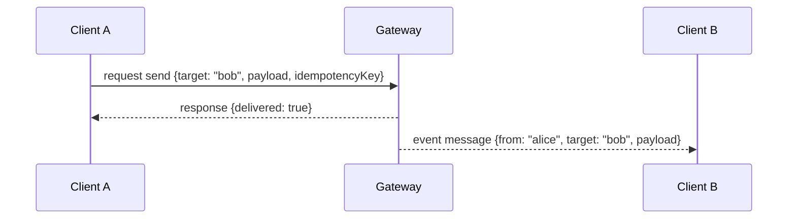

# Gateway architecture

## Overview

NEXO is gateway-centric. A single long-lived **Gateway** accepts WebSocket
connections from user clients and nodes, owns durable state, routes model inference,
and coordinates tool execution. There is no peer-to-peer client or node transport in
the current design.

The current Rust runtime is split across shared contracts and executable actors:

* `nexo-core` defines canonical Rust contracts for messages, tools, model
  descriptors, inference requests/responses, runs, and rounds.
* `nexo-ws-schema` defines the JSON WebSocket protocol frames, methods, event
  payloads, and generated schema surface.
* `nexo-gateway` runs the WebSocket daemon, SQLite persistence, prompt storage,
  cron scheduler, run loop, and gateway-native tools.
* `nexo-node` connects to the Gateway, registers tools, loads local models, and
  executes `run.round` through `nexo-ai`.
* `nexo-ai` is the library-first local inference runtime that adapts `nexo-core`
  requests to `mistralrs-core`.

## Component View



## Gateway

The Gateway daemon binds to the configured host and port, defaulting to
`127.0.0.1:6969`, and requires the configured auth header during WebSocket upgrade.

Current responsibilities:

* Maintain connected user and node peers in memory.
* Persist device and user identity, sessions, runs, run rounds, conversation entries,
  tool traces, run summaries, capability locks, and cron jobs in SQLite.
* Maintain in-memory registries for node-hosted tools, pending forwarded requests,
  loaded models, and available models.
* Expose typed request/response methods from `nexo-ws-schema`.
* Spawn the serialized run task (`RunHandle`) and cron scheduler at startup.
* Register gateway-native note and IO tools at startup.
* Route `run.round`, `tools.execute`, `model.load`, `model.unload`, and
  `image.analyze` requests to nodes when needed.
* Emit `tick`, `presence`, `message`, `run`, `cron`, `heartbeat`, and `shutdown`
  events when those flows occur.

The Gateway deserializes inbound payloads into typed schema structs. Runtime JSON
Schema files can be generated from `nexo-ws-schema`; request handling itself is based
on typed deserialization and handler-level validation.

## Clients

Clients connect with `role: "user"`.

Current behavior:

* One WebSocket connection represents one connected peer.
* `client.id` is the current user routing identity for sessions and directed
  messages.
* Multiple connected peers may share a `client.id`; all matching peers receive
  directed `message` events for that target.
* `device.id` identifies the concrete device and is persisted with first/last seen
  timestamps.
* Clients can call `health`, `status`, `send`, `session.*`, `run.*`, `tools.*`,
  `cron.*`, `prompt.*`, `image.analyze`, and `system-presence` methods according to
  their role and handler support.

## Nodes

Nodes connect to the same WebSocket server with `role: "node"`.

Current behavior:

* Nodes provide a device identity, capability labels, command names, and available
  model IDs in `connect`.
* After handshake, nodes register full `nexo-core` tool definitions with
  `tools.register`.
* Nodes publish loaded model descriptors and available model IDs with `model.status`.
* Nodes handle Gateway-directed `tools.execute`, `run.round`, `image.analyze`,
  `model.load`, and `model.unload` requests.
* Nodes execute at most one inference-class request at a time. A second `run.round` or
  `image.analyze` receives `node_busy`.
* Nodes automatically reconnect and must re-register tools and republish model status
  after reconnecting.

The current local inference path is embedded in the node instead of managed as a
separate external model-server process. `nexo-node` embeds `nexo-ai`, which builds a
local `NexoAi` service from downloaded model configs and submits shared `nexo-core`
inference requests to `mistralrs-core`.

## Connection Lifecycle

```mermaid
sequenceDiagram
    participant Peer as Client or Node
    participant Gateway
    participant DB as SQLite

    Peer->>Gateway: request connect {role, client, device?, models?}
    Gateway->>Gateway: protocol/auth/typed payload checks
    Gateway->>DB: upsert device; upsert user when role=user
    Gateway-->>Peer: response hello-ok {protocol, policy}
    Gateway-->>Peer: event presence {status: online}
    Gateway-->>Peer: event tick ...

    alt peer disconnects
        Gateway-->>Peer: close
        Gateway->>Gateway: remove peer, deregister node tools, forget loaded/available models
        Gateway-->>Peer: event presence {status: offline}
    end
```

## Node Registration and Tool Routing



## Run Loop

The Gateway spawns a single **RunHandle** at startup. Request handlers submit run
commands to this background task over an mpsc channel. The task processes commands
sequentially.

When a client sends `run.start`:

1. The handler creates or resolves a session and creates a `runs` row.
2. The handler submits `RunCommand::StartRun` with input, optional instructions,
   optional model ID, prompt collection, and typed reasoning settings.
3. The run task persists transcript entries and executes rounds.
4. Each round assembles context, routes inference, sends one `run.round`, handles
   either final content or tool calls, and repeats until terminal status or queueing.
5. Run lifecycle events are broadcast to connected clients.

Details: [Run Loop](agent_loop.md)



## Model Loading and Local Inference

`nexo-model-mgmt` owns model manifests, local storage paths, downloads, and reusable
`models` CLI commands. `nexo-ai` converts downloaded manifests into
`RegisteredModelConfig` values and builds a runtime from those configs. `nexo-node`
uses those configs; it should not construct loader configs itself.

Current model flow:

1. A node discovers downloaded models and includes their IDs in the `connect` payload.
2. The node may auto-load startup models based on configured startup capabilities.
3. The node sends `model.status` with loaded `ModelDefinition` values and available
   model IDs.
4. If a run requests a model that is available but not loaded, the Gateway sends
   `model.unload` for other loaded models on that node, then `model.load` for the
   requested model.
5. `nexo-node` rebuilds its embedded `NexoAi` service when loaded model state changes
   and sends a fresh `model.status`.

## Sessions and Prompt Collections

Sessions are durable conversation containers owned by a user identity.

* Sessions are created explicitly with `session.create` or implicitly by `run.start`.
* `session.list` returns prior sessions for the calling user's `client.id`.
* `session.get` returns the persisted conversation messages for a session.
* `session.clear` clears session data.
* A session may reference `prompt_collection_id`.
* Prompt documents live in git-backed `PROMPTS/`.
* Prompt collection metadata lives in git-backed `PROMPTS/collections.json` as a bare
  JSON array. The loader still accepts the old wrapped shape for existing storage.

## Gateway-Native Tools

Gateway-native tools execute inside the Gateway process and appear in `tools.catalog`
with `source: "gateway"`. They are tried before node forwarding.

Current gateway-native tool families:

* `notes.*` from `nexo-notes`, backed by git storage.
* `io.*` from `nexo-io`, covering filesystem, shell, and web-fetch style operations.

Node tools are deregistered when the hosting peer disconnects. Gateway-native tools
remain available for the life of the Gateway process.

## Capability Locks

The run loop currently uses advisory SQLite locks for tool capability families. The
capability is the prefix before the first `.` in the tool name. Locks expire after 5
minutes for crash recovery and are released after each tool call or when a run reaches
a terminal state.

The current implementation executes tool calls sequentially. Future scheduling should
use `ToolExecutionConstraints` from `nexo-core` to parallelize read-only or explicitly
parallel-safe tools.

## Cron Scheduler

A background scheduler runs every 60 seconds. When a due cron job fires, the Gateway:

1. emits a `cron` event;
2. creates or resolves a session;
3. creates a run with thinking disabled;
4. submits `RunCommand::StartRun` to the same serialized run task;
5. updates cron timestamps to avoid retry storms.

## Client-to-Client Messaging



`send` routes to connected user peers whose `client.id` matches the target, excluding
the origin peer. The current `send` handler reports whether at least one matching peer
was reached.

## Wire Protocol Summary

* Transport is WebSocket text frames containing JSON.
* The first frame **MUST** be `connect`.
* After handshake, requests use `{type: "request", id, method, params}`.
* Responses use `{type: "response", id, ok, payload | error}`.
* Events use `{type: "event", event, payload, seq?}`.
* Multiword fields use camelCase on the wire, such as `sessionId`, `modelId`,
  `toolCalls`, `thinkingContent`, and `idempotencyKey`.
* Nodes **MUST** connect with `role: "node"` and should advertise tools, commands,
  and available model IDs.

Idempotency keys are part of the public shape for side-effecting requests such as
`run.start`, `send`, and `tools.execute`. Today `run.start` stores a unique
idempotency key on the `runs` row; broader replay/dedupe behavior is still an open
implementation area.

## Pairing and Identity

All WebSocket peers may include a device identity on `connect`.

* For nodes, the Gateway stores the device identity and role.
* For users, the Gateway stores both the user identity (`client.id`) and the concrete
  `device.id`.
* The persistent identity store tracks first-seen and last-seen timestamps.

Details: [Gateway Protocol](/nexo/gateway_protocol.md)
