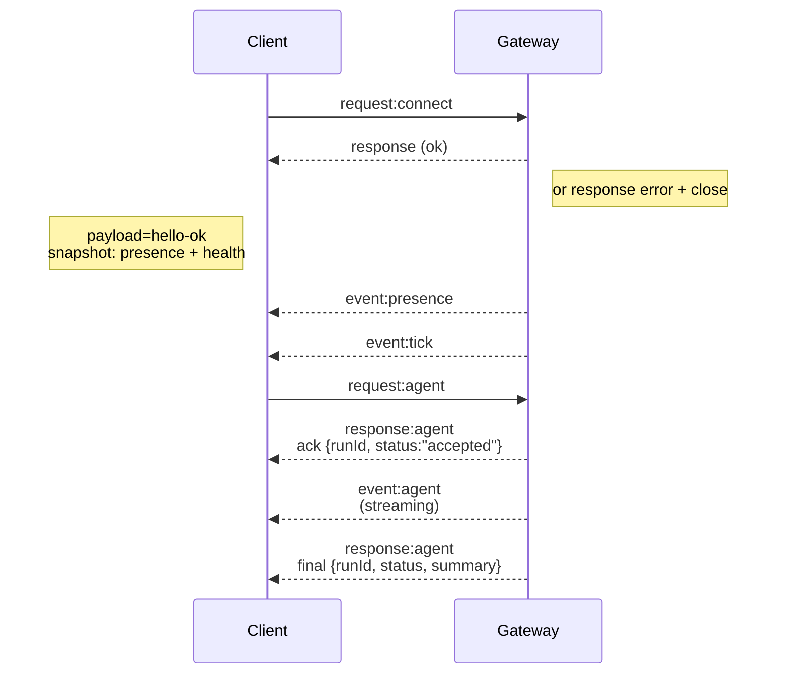
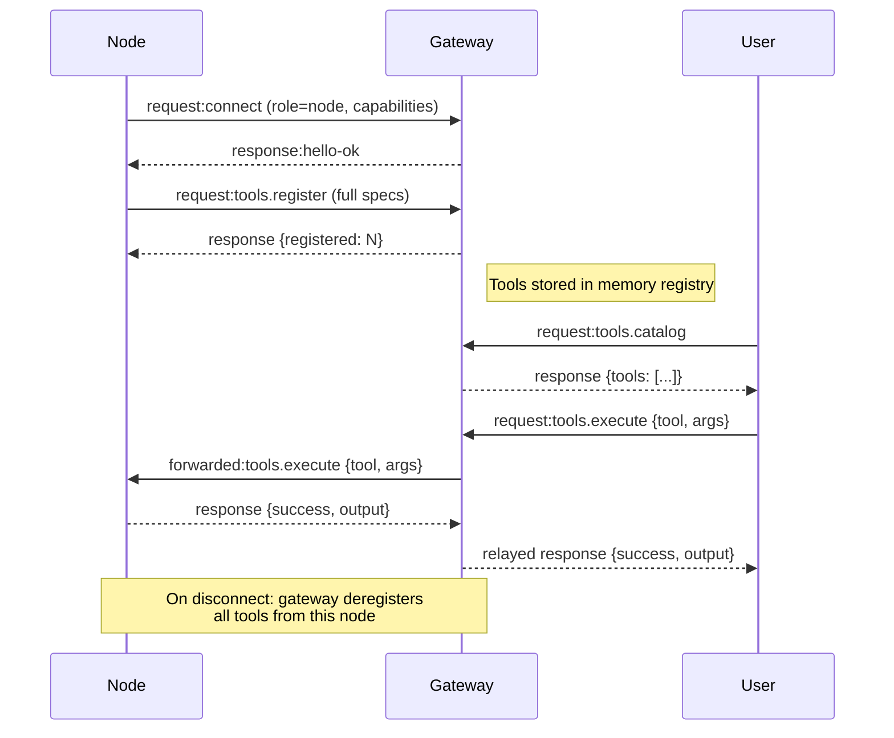

# Gateway architecture

## Overview

- A single long‑lived **Gateway** is the heart of the system.
- Control-plane clients (macOS/iOS app, CLI) connect to the
  Gateway over **WebSocket** on the configured bind host (default
  `127.0.0.1:6969`).
- **Nodes** (macOS/iOS/headless) also connect over **WebSocket**, but
  declare `role: node` with explicit capabilities/commands.

## Components and flows

### Gateway (daemon)

- Maintains connections to clients and nodes
- Exposes a typed WS API (requests, responses, server‑push events).
- Validates inbound frames against JSON Schema.
- Emits events like `agent`, `chat`, `presence`, `health`, `heartbeat`, `cron`.

### Clients (macOS / iOS app / CLI)

- One WS connection per client.
- Provide a user identity in `connect` and client identity; pairing is **user‑based** (`role: "user"`), client identity is informational (e.g. `cli`, `iOS`, `macOS`). The `role` field is the sole discriminator between users and nodes.
- Send requests (`health`, `status`, `send`, `agent`, `system-presence`).
- Subscribe to events (`tick`, `agent`, `presence`, `shutdown`).

### Nodes (macOS / iOS / headless)

- Connect to the **same WS server** with `role: node`.
- Provide a device identity in `connect`; pairing is **device‑based** (role `node`)
- After handshake, register full tool specs via `tools.register`.
- Listen for `tools.execute` requests forwarded by the gateway.
- Expose commands like `epub_extractor.*`, `echo.*`, `ping`.
- Automatically reconnect and re-register on disconnect.

## Connection lifecycle (single client)

## Node registration + tool execution

## Wire protocol (summary)

- Transport: WebSocket, text frames with JSON payloads.
- First frame **must** be `connect`.

- After handshake:
  - Requests: `{type:"request", id, method, params}` → `{type:"response", id, ok, payload|error}`
  - Events: `{type:"event", event, payload, seq?, stateVersion?}`
- Idempotency keys are required for side‑effecting methods (`send`, `agent`) to
  safely retry; the server keeps a short‑lived dedupe cache.
- Nodes must include `role: "node"` plus capabilities/commands in `connect`.

## Pairing

- All WS clients (users + nodes) include a **device identity** on `connect`.
- Users also provide a **user identity** (role `user`)
- The gateway stores the device identity for nodes, and the user identity + device identity for clients, in it's persistent memory store, including the time it was first seen and last seen.

Details: [Gateway protocol](/nexo/gateway_protocol.md)
