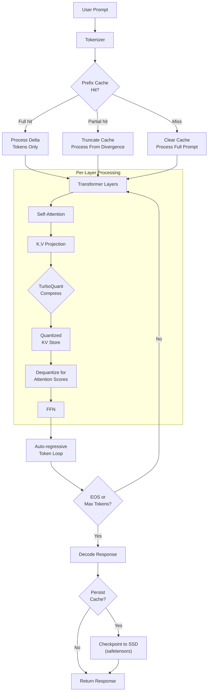
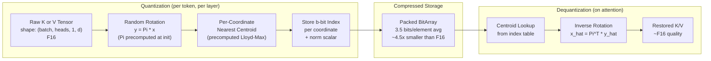
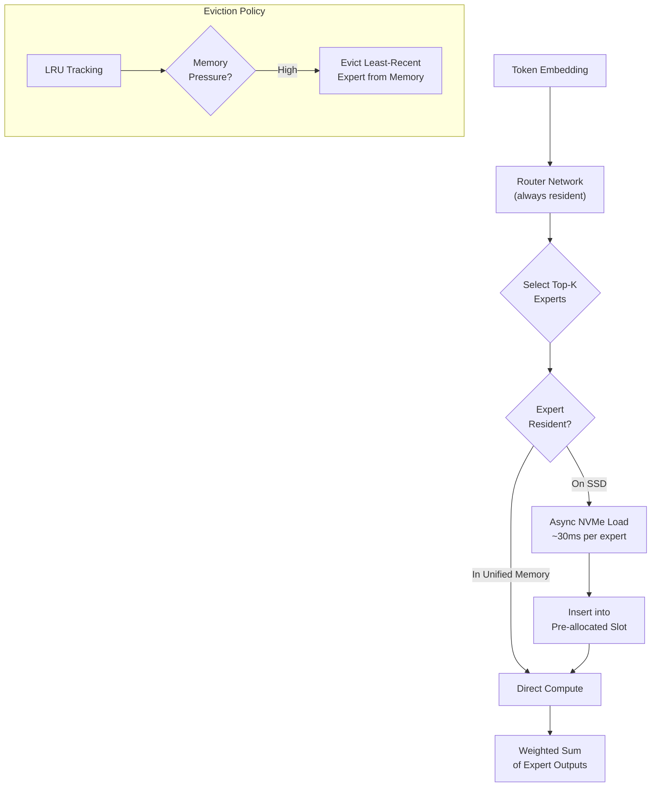
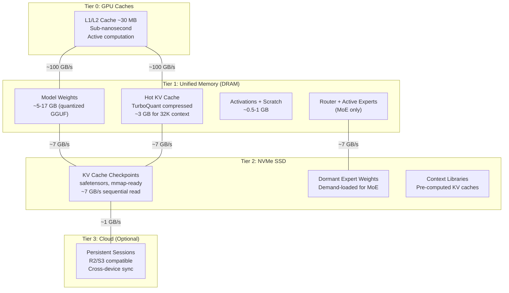
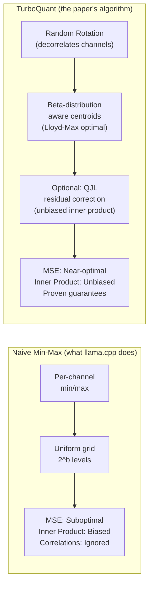

# Efficient Inference on Apple Silicon: TurboQuant KV Cache Compression & Flash-Aware Weight Loading

> Research synthesis of Google's TurboQuant (arXiv 2504.19874) and Apple's "LLM in a Flash" (arXiv 2312.11514), with a concrete implementation plan for integrating these techniques into the nexo-ai Rust inference engine.

---

## 1. Introduction

### 1.1 The Memory Wall on Apple Silicon

On an M4 Mac mini with 16 GB unified memory, model weights, KV cache, and activations all compete for the same pool. A Qwen3-30B-A3B MoE model quantized to Q4_K_M occupies ~17 GB -- already exceeding physical RAM and requiring SSD paging. The KV cache grows linearly with sequence length:

```
KV cache bytes = 2 * num_layers * seq_len * num_kv_heads * head_dim * bytes_per_element
```

For Qwen3-30B-A3B (48 layers, 8 KV heads, 128 head dim, F16):

| Context Length | KV Cache Size | Notes |
|---|---|---|
| 4K tokens | ~1.5 GB | Fits comfortably |
| 16K tokens | ~6 GB | Tight on 16 GB machine |
| 32K tokens | ~12 GB | Exceeds available memory after model weights |
| 64K tokens | ~24 GB | Impossible without compression |

This is the wall. The nexo-ai engine currently clears the KV cache on every generation call (`pipeline.rs` line 174: `state.weights.clear_kv_cache()`), and the `KvCacheState` trait has `truncate_to` planned but unimplemented. There is significant room for improvement at both the algorithmic and systems level.

Two recent papers provide complementary solutions: Google's TurboQuant compresses the KV cache 4x+ with near-zero quality loss, and Apple's "LLM in a Flash" enables running models larger than DRAM via intelligent flash-to-memory paging.

---

### 1.2 Apple's "LLM in a Flash" (arXiv 2312.11514)

**Authors**: Keivan Alizadeh, Iman Mirzadeh, Dmitry Belenko et al. (Apple)

This paper addresses running LLMs that exceed available DRAM by storing model parameters in flash (NVMe SSD) and loading them on demand. The key insight is that inference is memory-bandwidth-bound, not compute-bound, so optimizing data transfer patterns yields large speedups.

#### Core Architecture

```
Flash Memory (~100+ GB, ~1 GB/s random, ~7 GB/s sequential)
    |
    v
DRAM / Unified Memory (~16-192 GB, ~100 GB/s)
    |
    v
GPU Caches & Registers (~30 MB, sub-nanosecond)
```

#### Technique 1: Sparsity-Aware Selective Loading

FFN (Feed-Forward Network) layers in transformer models exhibit 90-97% activation sparsity when using ReLU activations. A small low-rank predictor (~2.5% of model size, <5% of inference time) forecasts which neurons will activate before the FFN computation. Only the weights for predicted-active neurons are loaded from flash.

**Predictor architecture**: A single linear layer `R x d_model -> R x d_ffn` followed by a sigmoid, where `R` (rank) is ~240 for OPT-6.7B. The predictor takes the output of the current attention layer (not the previous FFN) as input, yielding more accurate predictions due to deferred timing.

**Impact on data transfer**: For OPT-6.7B with 97% sparsity, instead of loading the full ~13.4 GB of FFN weights per forward pass, only ~0.9 GB needs to be transferred from flash.

#### Technique 2: Sliding Window for Incremental Loading

Neuron activation patterns are stable across adjacent tokens. The paper defines `s_agg(k)` as the cumulative set of unique neurons activated across `k` tokens. As `k` grows, the marginal new neurons `s_agg(k+1) - s_agg(k)` rapidly decreases (from ~40% at k=1 to ~5% at k=25).

This means that a DRAM "window" caching the last k tokens' active neurons needs very few new loads per token. In practice with k=5, the incremental load per token is only ~5-10% of the initial load.

#### Technique 3: Row-Column Bundling

In an FFN layer, the i-th column of the up-projection and the i-th row of the down-projection always co-activate (they correspond to the same intermediate neuron). By storing these contiguously in flash, a single sequential read loads both, doubling the effective chunk size. Since flash throughput scales with chunk size (4 KB: ~1 GB/s, 32 KB: ~4 GB/s, 64 KB: ~6 GB/s on Apple NVMe), this nearly doubles loading throughput.

#### Technique 4: Pre-Allocated DRAM Management

Rather than dynamically allocating memory for loaded neurons (which causes fragmentation and reallocation overhead), the paper pre-allocates a fixed matrix of size `Req_i x 2*d_model` per layer, where `Req_i` is the maximum neurons needed (measured on validation data). Management uses:
- **Pointer array**: Maps active indices to matrix rows
- **Deletion**: Overwrite deleted row with the last occupied row (O(c) for c deletions)
- **Insertion**: Append to the end of the used region (O(1) amortized)

#### Results

| Setup | Naive Latency | Optimized Latency | Speedup |
|---|---|---|---|
| OPT-6.7B, CPU, M1 Max | 3182 ms/token | 669 ms/token | **4.8x** |
| OPT-6.7B, Metal M1 | 2389 ms/token | 565 ms/token | **4.2x** |
| OPT-6.7B, Metal M2 | 2270 ms/token | 305 ms/token | **7.4x** |
| OPT-6.7B, RTX 4090 | 2218 ms/token | 84 ms/token | **26x** |

The paper demonstrates models running at 2x the device's DRAM capacity with acceptable latency, and achieves near-zero accuracy degradation on zero-shot benchmarks.

#### Relevance to nexo-ai

- **Partially applicable**: Qwen3 uses SiLU activation (not ReLU), which yields lower sparsity (~60-70% vs 90%+). The technique is most effective for ReLU-based or ReLU-finetuned models.
- **MoE variant is a natural fit**: Qwen3-30B-A3B is a Mixture of Experts model where only 3B of 30B parameters are active per token. Expert weights could be demand-loaded from SSD rather than kept fully resident.
- **KV cache offloading**: The tiered memory concept applies directly -- cold KV cache entries could be offloaded to SSD, which is exactly what TurboQuant compression enables.
- **Apple's implementation detail**: They used MLX Metal kernels with `MTLStorageModeShared` allocation for zero-copy CPU/GPU memory sharing. nexo-ai already uses this via Candle's Metal backend.

---

### 1.3 Google's TurboQuant (arXiv 2504.19874)

**Authors**: Amir Zandieh, Majid Daliri, Majid Hadian, Vahab Mirrokni (Google Research / Google DeepMind / NYU)

TurboQuant is a vector quantization algorithm optimized for both mean-squared error (MSE) and inner product distortion. It achieves near-optimal compression rates with provable guarantees, making it ideal for online KV cache quantization where data arrives as a stream during inference.

#### The Problem with Naive KV Cache Quantization

Standard per-channel min-max quantization (what llama.cpp's `--cache-type-k q4_0` does) treats each channel independently but ignores correlations between channels. The quantization boundaries are data-dependent and suboptimal. More critically for attention mechanisms, min-max quantization introduces **bias** in inner product estimation -- the dequantized vectors' dot products systematically differ from the originals, which corrupts attention scores.

#### TurboQuant Algorithm (MSE-Optimized Variant)

**Step 1 - Random Rotation**: Generate a random orthogonal matrix `Pi` (d x d) via QR decomposition of a matrix with i.i.d. N(0,1) entries. This is done **once** at model initialization.

For any input vector `x`, compute `y = Pi * x`. By Lemma 1 of the paper, each coordinate `y_j` of the rotated vector follows a scaled/shifted Beta distribution:

```
y_j ~ f_X(x) = Gamma(d/2) / (sqrt(pi) * Gamma((d-1)/2)) * (1 - x^2)^((d-3)/2)
```

In high dimensions (d >> 1), this converges to N(0, 1/d) by the central limit theorem. Crucially, distinct coordinates become **nearly independent**, enabling per-coordinate scalar quantization without cross-coordinate codebooks.

**Step 2 - Optimal Scalar Quantization**: Solve the continuous 1D k-means problem (Lloyd-Max algorithm) for the Beta distribution to find optimal centroids. For bit-width `b`, this partitions `[-1, 1]` into `2^b` intervals with centroids minimizing expected quantization error:

```
C(f_X, b) = min over centroids  sum_i integral |x - c_i|^2 * f_X(x) dx
```

These centroids are **precomputed once** for each (d, b) pair and stored as lookup tables. For practical dimensions and b=1,2,3,4, the paper provides:
- b=1: centroids at +/- sqrt(2/pi) / sqrt(d)
- b=2: centroids at +/- 0.453/sqrt(d), +/- 1.51/sqrt(d)
- MSE distortion: 0.36, 0.117, 0.03, 0.009 for b=1,2,3,4

**Step 3 - Quantize**: For each coordinate of `y`, find the nearest centroid and store its b-bit index.

**Step 4 - Dequantize**: Look up centroids from stored indices, then rotate back: `x_hat = Pi^T * y_hat`.

#### TurboQuant Algorithm (Inner Product Variant)

The MSE-optimal quantizer introduces multiplicative bias in inner product estimation (factor of 2/pi at b=1). To correct this:

1. Apply TurboQuant_mse with bit-width `b-1`
2. Compute residual: `r = x - DeQuant_mse(Quant_mse(x))`
3. Apply 1-bit QJL (Quantized Johnson-Lindenstrauss) on the residual:
   - `qjl = sign(S * r)` where `S` is a random Gaussian matrix
   - Dequantize: `x_qjl = sqrt(pi/2)/d * S^T * qjl * ||r||`
4. Final estimate: `x_hat = x_mse + x_qjl`

This is provably **unbiased**: `E[<y, x_hat>] = <y, x>` for any vectors x, y.

#### Outlier Channel Handling

Real transformer KV caches have outlier channels with 10x larger magnitude than typical channels. TurboQuant handles this by:
1. Computing per-channel variance across a calibration window
2. Identifying the top ~25% channels as outliers
3. Quantizing outliers at 3 bits, regular channels at 2 bits
4. Achieving an effective 2.5 bits/channel average

This mixed-precision approach is critical for practical quality and is validated on the LongBench benchmark.

#### Experimental Results

**KV Cache Compression (LongBench-V1)**:

| Method | KV Size (bits) | Average Score |
|---|---|---|
| Full Cache | 16 | 50.06 |
| KIVI (3-bit) | 3 | 48.50 |
| KIVI (5-bit) | 5 | 50.16 |
| PolarQuant (3.9-bit) | 3.9 | 49.78 |
| **TurboQuant (2.5-bit)** | **2.5** | **49.44** |
| **TurboQuant (3.5-bit)** | **3.5** | **50.06** |

At 3.5 bits, TurboQuant achieves **identical** performance to the full 16-bit cache -- a 4.5x compression with zero quality loss. At 2.5 bits (6.4x compression), quality remains within 1.2% of baseline.

**Needle-in-a-Haystack** (4K to 104K tokens): TurboQuant at 4x compression achieves a score of 0.997 vs 0.997 for full precision -- indistinguishable.

**Quantization Speed**: Near-instantaneous.

| Dimension | Time (seconds) |
|---|---|
| d=200 | 0.0007 |
| d=1536 | 0.0013 |
| d=3072 | 0.0021 |

This is fast enough for online quantization during inference without measurable latency impact.

---

## 2. Skepticism Assessment of mac-code Claims

The `mac-code` repository presents itself as implementing ideas from both papers. After thorough code review, the reality is more nuanced.

### 2.1 What mac-code Actually Implements

| Component | Claimed | Actual Implementation |
|---|---|---|
| **Inference engine** | "mac code" | HTTP wrapper around llama.cpp's `/v1/chat/completions` endpoint |
| **TurboQuant** | "4x KV compression at 0.993 cosine" | Standard min-max asymmetric quantization with per-group scaling. No random rotation, no Beta-distribution centroids, no QJL residual correction |
| **LLM in a Flash** | "SSD paging" | Relies on macOS virtual memory (swap) for the 35B model. The explicit paging is 512-token checkpoint/resume via MLX's `save_prompt_cache` |
| **KV cache persistence** | "Load in 0.0003s" | numpy `.npz` save/load. Plausible timing for small caches (<1 MB) but not representative of full-context loads |
| **Cross-device sync** | "R2 cloud sync" | Upload/download functions exist but are disconnected from inference |

### 2.2 Claim-by-Claim Verdict

**"30 tok/s on a $600 Mac mini"** -- **Plausible, but misattributed.** This is llama.cpp's achievement with `--flash-attn on --n-gpu-layers 99 --cache-type-k q4_0 --cache-type-v q4_0`. The mac-code agent.py is a thin Python wrapper making HTTP POST requests. The 30 tok/s speed is entirely from llama.cpp's optimized Metal kernels. Any Python script calling the same endpoint would achieve the same speed.

**"TurboQuant 4x compression at 0.993 cosine similarity"** -- **Misleading.** The `turboquant.py` implementation is textbook min-max quantization:
```python
# Actual code (turboquant.py lines 40-89):
scale = (max_val - min_val) / (2**bits - 1)
zero = min_val
x_quant = round((x - zero) / scale)  # Standard uniform quantization
```
This is the same as llama.cpp's Q4_0. The real TurboQuant paper's algorithm involves random orthogonal rotation, Beta-distribution-aware Lloyd-Max centroids, and optional QJL residual correction. None of these appear in the code. The 0.993 cosine similarity at 4-bit is expected from any reasonable quantizer and doesn't validate the "TurboQuant" branding.

**"0.0003s load time (6677x faster than reprocessing)"** -- **Plausible for small caches.** Memory-mapping a few-MB `.npz` file can indeed achieve sub-millisecond "load" times on Apple's fast NVMe. However, a full 64K-context KV cache at F16 would be ~3-12 GB depending on the model, and loading that from SSD would take ~0.5-2 seconds. The 0.0003s figure is for a 141-token cache (~0.05 MB), which is a trivial case.

**"35B model on 16GB hardware"** -- **True, but it's macOS swap.** The Qwen3.5-35B-A3B at IQ2_M quantization is 10.6 GB on disk. On a 16 GB machine, macOS pages portions of the model to/from SSD via its standard virtual memory system. llama.cpp's `--n-gpu-layers 99` asks Metal to use the full unified memory pool, and the OS handles swapping transparently. This is not a novel technique -- it's how every macOS application works when memory-constrained.

**"Text routing at 2.6 bpw is a breakthrough"** -- **Reasonable technique, overstated novelty.** Using a separate classification prompt ("reply with search, shell, or chat") to avoid structured JSON output from heavily-quantized models is practical engineering. It works because single-word classification is far easier than structured JSON generation. However, calling this a "breakthrough" overstates the case -- it's a well-known prompt engineering pattern.

### 2.3 What IS Genuinely Useful from mac-code

Despite the inflated claims, several architectural ideas are sound:

1. **Tiered cache hierarchy (GPU -> SSD -> Cloud)**: The concept of checkpointing KV cache to SSD for cross-session persistence, with optional cloud sync, is architecturally sound and worth implementing properly.

2. **Incremental context processing**: Splitting large documents into chunks and checkpointing is a practical approach for processing documents that exceed the context window.

3. **The realization that SSD bandwidth matters**: On Apple Silicon with ~7 GB/s NVMe, SSD-backed inference is viable for certain access patterns -- a key insight from the Apple paper that mac-code correctly identifies as important.

---

## 3. Potential Performance Improvements for nexo-ai

### 3.1 KV Cache Quantization via TurboQuant (Impact: Very High)

**Current state**: nexo-ai stores KV cache as full F16 tensors via Candle's `ConcatKvCache`. For Qwen3-30B-A3B at 32K context, this consumes ~12 GB.

**Proposed**: Implement the actual TurboQuant_mse algorithm to compress KV cache to 3.5 bits/element, reducing the 32K cache to ~2.7 GB.

**Expected gains**:
- 4.5x reduction in KV cache memory at 3.5 bits (quality-neutral per paper)
- 6.4x reduction at 2.5 bits (within 1.2% of baseline)
- Enables 64K+ context windows on 16 GB hardware
- Near-zero quantization overhead (~1 ms per layer per token)

### 3.2 KV Cache Prefix Reuse (Impact: High)

**Current state**: `pipeline.rs` clears the entire KV cache on every `generate()` call. In a multi-turn conversation, this means re-processing the full prompt (system prompt + all prior turns) every time.

**Proposed**: Track cached token IDs. On subsequent calls, compute the common prefix with the new prompt and only process the delta.

**Expected gains**:
- For a conversation with 2K system prompt + 500 tokens of history, save ~2.5K tokens of prefill per turn
- At ~30 tok/s prefill speed, saves ~80ms per turn
- Cumulative savings grow with conversation length

### 3.3 KV Cache SSD Persistence (Impact: Medium)

**Proposed**: Save quantized KV cache to disk between sessions using safetensors for zero-copy memory mapping. On session resume, load from SSD instead of re-processing the full prompt.

**Expected gains**:
- Instant session resumption for conversations with large system prompts or document context
- Enables "context libraries" -- pre-computed KV caches for common system prompts

### 3.4 Selective Expert Loading for MoE (Impact: Medium, Speculative)

**Proposed**: For Qwen3-30B-A3B, instead of loading all expert weights into memory, keep only the router and top-K experts resident. Demand-load other experts from SSD.

**Expected gains**:
- Could reduce memory footprint for MoE models significantly
- With Apple NVMe at ~7 GB/s, loading a single expert (~200 MB) takes ~30ms
- Requires profiling to determine if the latency is acceptable

### 3.5 Outlier-Aware Mixed-Precision KV Quantization (Impact: Medium)

**Proposed**: Per the TurboQuant paper, identify outlier channels (top ~25% by variance) and quantize at 3 bits while regular channels use 2 bits.

**Expected gains**:
- Effective 2.5 bits/channel instead of uniform 3-4 bits
- Better quality preservation for the same compression ratio
- Requires a calibration pass to identify outlier channels (can be done on first forward pass)

---

## 4. Architecture Diagrams

### 4.1 Enhanced Inference Pipeline



### 4.2 TurboQuant KV Cache Compression Pipeline



### 4.3 Flash-Aware MoE Expert Loading



### 4.4 Memory Tier Hierarchy on Apple Silicon



### 4.5 TurboQuant vs Naive Quantization Quality



---

## 5. Step-by-Step Implementation Plan

### Phase 0: Foundation (Prerequisites, no risk to existing code)

#### Step 0.1: Create Experimental Module Structure

Create a feature-gated experiments module so all new code is opt-in and doesn't affect production builds.

```
nexo-ai/src/
  experiments/
    mod.rs                    # Feature-gated: #[cfg(feature = "experiments")]
    turboquant/
      mod.rs
      rotation.rs             # Random orthogonal matrix generation
      lloyd_max.rs            # Precomputed centroid tables
      quantize.rs             # Core quantize/dequantize
      compressed_kv_cache.rs  # Drop-in replacement for ConcatKvCache
      outlier.rs              # Mixed-precision outlier handling
      bench.rs                # Quality + speed benchmarks
    cache_persist/
      mod.rs                  # KV cache serialization to safetensors
      session.rs              # Session save/load/resume
    flash_loading/
      mod.rs                  # MoE demand-loading
      expert_pool.rs          # LRU expert cache with SSD backing
```

**Cargo.toml addition**:
```toml
[features]
experiments = []
```

**Files to modify**:
- `nexo-ai/src/lib.rs` -- Add `#[cfg(feature = "experiments")] pub mod experiments;`
- `nexo-ai/Cargo.toml` -- Add `experiments` feature

#### Step 0.2: Complete KvCacheState Trait

Implement `truncate_to` and `cache_token_count` for all model variants. This is prerequisite infrastructure for prefix caching.

**Files to modify**:
- `nexo-ai/src/shared/templates/kv_cache.rs` -- Define trait methods fully
- Model-specific implementations (qwen3, gemma3) -- Implement trait for their weight structs

The implementation needs to access Candle's internal `ConcatKvCache` state and narrow the concatenated K/V tensors along the sequence dimension.

#### Step 0.3: Add KV Cache Size Tracking

Add methods to compute and track KV cache memory usage based on model architecture parameters.

**Files to modify**:
- `nexo-ai/src/shared/model_traits.rs` -- Add `fn kv_cache_bytes(&self) -> u64` to ModelInfo
- `nexo-ai/src/statistics/mod.rs` -- Track cache size in StatsCollector

---

### Phase 1: Prefix Caching (Medium effort, immediate payoff)

#### Step 1.1: Track Cached Token State

Add `cached_token_ids: Vec<u32>` to `LoadedState` in each model's pipeline. After each generation call, store the full token sequence that is now cached.

**Files to modify**:
- `nexo-ai/src/models/multipurpose/qwen3/pipeline.rs` -- Add field to LoadedState, modify generate()

#### Step 1.2: Compute Common Prefix

Before clearing the KV cache, compare `cached_token_ids` with the new `prompt_tokens`. Find the longest common prefix. If the prefix covers >50% of the new prompt, truncate the cache to the common prefix length and only forward the delta tokens.

**Logic**:
```rust
let common_len = cached_token_ids.iter()
    .zip(prompt_tokens.iter())
    .take_while(|(a, b)| a == b)
    .count();

if common_len > 0 {
    state.weights.truncate_kv_cache(common_len);
    // Only process tokens from common_len onward
    let delta = &prompt_tokens[common_len..];
    let input = Tensor::new(delta, &state.device)?.unsqueeze(0)?;
    let logits = state.weights.forward(&input, common_len)?;
} else {
    state.weights.clear_kv_cache();
    // Process full prompt as before
}
```

#### Step 1.3: Integrate with ConversationManager

Update `ConversationManager` to track token boundaries so that prefix reuse works correctly across conversation turns.

**Files to modify**:
- `nexo-ai/src/shared/templates/conversation.rs` -- Track per-turn token counts

---

### Phase 2: TurboQuant Core Implementation (High effort, highest payoff)

#### Step 2.1: Random Orthogonal Matrix Generation

Implement `random_orthogonal(d: usize, device: &Device) -> Result<Tensor>` using QR decomposition of a random Gaussian matrix.

**File**: `nexo-ai/src/experiments/turboquant/rotation.rs`

**Algorithm**:
1. Generate `d x d` tensor with i.i.d. N(0, 1) entries using Candle's random API
2. Compute QR decomposition: `A = Q * R`
3. Ensure proper sign convention: `Q = Q * diag(sign(diag(R)))`
4. Return Q as the rotation matrix

**Note**: Candle may not have built-in QR decomposition. If not, implement Householder QR or use the Gram-Schmidt process. For the dimensions involved (d = 128 for head_dim), this is a small matrix and even a naive implementation is fast.

**Storage**: Generate once at model load time. Store `Pi` (and `Pi^T`) as persistent tensors in the quantizer state.

#### Step 2.2: Lloyd-Max Centroid Precomputation

Precompute optimal centroids for the Beta distribution at various (d, b) combinations.

**File**: `nexo-ai/src/experiments/turboquant/lloyd_max.rs`

**Algorithm** (offline, run once):
1. For dimension d and bit-width b, define `f_X(x) = Gamma(d/2) / (sqrt(pi) * Gamma((d-1)/2)) * (1-x^2)^((d-3)/2)`
2. Initialize 2^b centroids uniformly in [-1, 1]
3. Iterate Lloyd-Max:
   a. Assign: each point maps to nearest centroid
   b. Update: centroid = weighted mean of assigned region using f_X as weight
   c. Repeat until convergence
4. Store as static arrays

**Practical shortcut**: For d >= 64 (which covers all modern LLM head dimensions), f_X converges to N(0, 1/d). The optimal centroids for a Gaussian are well-known and can be looked up from tables or computed analytically. The paper provides specific values for b=1,2,3,4 which can be hardcoded.

**Centroid table** (for large d, approximating as Gaussian):

| Bits | Centroids (scaled by 1/sqrt(d)) |
|---|---|
| 1 | +/- 0.7979 (sqrt(2/pi)) |
| 2 | +/- 0.453, +/- 1.510 |
| 3 | +/- 0.245, +/- 0.756, +/- 1.344, +/- 2.152 |
| 4 | 16 centroids from standard Gaussian Lloyd-Max |

#### Step 2.3: Core Quantization and Dequantization

Implement the quantize and dequantize functions using Candle tensor operations.

**File**: `nexo-ai/src/experiments/turboquant/quantize.rs`

**Quantize**:
```rust
pub struct CompressedKv {
    indices: Vec<u8>,        // Packed bit indices
    norm: f32,               // L2 norm of original vector (for rescaling)
    shape: Vec<usize>,       // Original tensor shape
    bits: u8,                // Bit width used
}

pub fn quantize_kv(
    tensor: &Tensor,          // shape: (batch, heads, seq, head_dim)
    rotation: &Tensor,        // shape: (head_dim, head_dim)
    centroids: &[f32],        // 2^bits centroid values
    bits: u8,
) -> Result<CompressedKv> {
    // 1. Compute and store L2 norm for rescaling
    // 2. Normalize to unit sphere
    // 3. Rotate: y = x @ rotation.T  (last dim matmul)
    // 4. For each coordinate, find nearest centroid index
    // 5. Pack indices into bit array
}
```

**Dequantize**:
```rust
pub fn dequantize_kv(
    compressed: &CompressedKv,
    rotation: &Tensor,
    centroids: &[f32],
) -> Result<Tensor> {
    // 1. Unpack bit indices
    // 2. Look up centroid values
    // 3. Rotate back: x_hat = y_hat @ rotation  (inverse rotation = transpose)
    // 4. Rescale by stored norm
}
```

**Key Candle operations needed**:
- `Tensor::matmul` -- For rotation
- `Tensor::broadcast_sub` / `broadcast_add` -- For centroid distance computation
- `Tensor::argmin` -- For finding nearest centroid
- `Tensor::gather` -- For centroid lookup during dequantization

#### Step 2.4: Compressed KV Cache

Create `QuantizedKvCache` as a drop-in replacement for `ConcatKvCache` that stores compressed representations.

**File**: `nexo-ai/src/experiments/turboquant/compressed_kv_cache.rs`

```rust
pub struct QuantizedKvCache {
    k_compressed: Vec<CompressedKv>,  // One per seq position
    v_compressed: Vec<CompressedKv>,
    rotation_k: Tensor,               // Rotation matrix for K
    rotation_v: Tensor,               // Rotation matrix for V
    centroids: Vec<f32>,              // Shared centroid table
    bits: u8,
    seq_len: usize,
}

impl QuantizedKvCache {
    pub fn append(&mut self, k: &Tensor, v: &Tensor) -> Result<()> {
        // Quantize new K/V and append to compressed store
    }

    pub fn current_kv(&self) -> Result<(Tensor, Tensor)> {
        // Dequantize all stored K/V for attention computation
    }

    pub fn clear(&mut self) {
        self.k_compressed.clear();
        self.v_compressed.clear();
        self.seq_len = 0;
    }

    pub fn truncate_to(&mut self, len: usize) {
        self.k_compressed.truncate(len);
        self.v_compressed.truncate(len);
        self.seq_len = len;
    }
}
```

**Integration strategy**: The `QuantizedKvCache` wraps around the model's attention layer. During the forward pass, after K/V projection and RoPE, the compressed cache is updated. Before attention score computation, the full K/V history is dequantized. This approach is transparent to the rest of the model.

#### Step 2.5: Outlier Detection and Mixed-Precision

**File**: `nexo-ai/src/experiments/turboquant/outlier.rs`

Implement per-channel variance tracking and outlier identification:
1. On the first forward pass, compute per-channel variance of K and V tensors across the sequence
2. Rank channels by variance
3. Mark top 25% as outliers
4. Store outlier mask per layer
5. On subsequent passes, quantize outlier channels at `bits+1` and regular channels at `bits`

---

### Phase 3: KV Cache Persistence (Medium effort)

#### Step 3.1: Serialization Format

**File**: `nexo-ai/src/experiments/cache_persist/mod.rs`

Use safetensors for zero-copy memory mapping. Store alongside a JSON metadata file:

```json
{
  "model_name": "qwen3-30b-a3b",
  "model_hash": "sha256:abc...",
  "token_count": 4096,
  "quantization": {
    "algorithm": "turboquant_mse",
    "bits": 3,
    "rotation_seed": 42
  },
  "created_at": "2026-03-26T12:00:00Z"
}
```

#### Step 3.2: Session Manager

**File**: `nexo-ai/src/experiments/cache_persist/session.rs`

```rust
pub struct SessionManager {
    cache_dir: PathBuf,  // ~/.nexo-ai/cache/
}

impl SessionManager {
    pub fn save_session(&self, name: &str, cache: &QuantizedKvCache, metadata: SessionMeta) -> Result<()>;
    pub fn load_session(&self, name: &str) -> Result<(QuantizedKvCache, SessionMeta)>;
    pub fn list_sessions(&self) -> Result<Vec<SessionMeta>>;
    pub fn delete_session(&self, name: &str) -> Result<()>;
}
```

**Integration**: Add `save_session` / `load_session` commands to the CLI.

---

### Phase 4: Flash-Aware MoE Loading (High effort, speculative)

#### Step 4.1: Expert Pool with SSD Backing

**File**: `nexo-ai/src/experiments/flash_loading/expert_pool.rs`

For MoE models, implement an LRU cache of expert weights:
1. At model load, only load the router and the top-K most frequently used experts
2. Memory-map all expert weight files (safetensors) for demand loading
3. When a non-resident expert is selected by the router, load it from the memory-mapped file
4. Track access frequency; evict least-recently-used experts when memory pressure is high

**Key decision**: Whether the ~30ms load latency per expert is acceptable. Profile on target hardware before committing to this approach.

#### Step 4.2: Memory-Mapped Weight Access

Use `memmap2` crate for zero-copy access to safetensor files. Candle already supports loading from memory-mapped safetensors, so the infrastructure exists.

---

### Phase 5: Benchmarking Harness

#### Step 5.1: Quality Benchmarks

**File**: `nexo-ai/src/experiments/turboquant/bench.rs`

Measure quantization quality:
- MSE between original and dequantized KV tensors
- Cosine similarity per layer
- Attention score divergence (compute attention with full vs quantized KV)
- End-to-end generation quality (perplexity on a held-out dataset)

#### Step 5.2: Performance Benchmarks

**File**: `nexo-ai/benches/turboquant.rs` (using criterion)

Measure:
- Quantization throughput (GB/s of KV data compressed)
- Dequantization throughput
- Memory usage before/after compression
- Generation speed impact (tokens/second with vs without TurboQuant)
- Prefix cache hit rates across multi-turn conversations

---

## 6. Quick Wins (Immediate Improvements)

These improvements can be made to the existing codebase without the experimental infrastructure.

### 6.1 Stop Clearing KV Cache Every Turn

**Effort**: Low | **Impact**: High | **Risk**: Low

The simplest and highest-impact change. Currently `pipeline.rs` calls `clear_kv_cache()` unconditionally. Adding a `Vec<u32>` to `LoadedState` to track cached tokens and computing the common prefix before deciding to clear is straightforward.

Even without `truncate_to`, simply not clearing when the prompt is identical to the cached state avoids redundant prefill for repeated prompts (e.g., benchmarking, retry scenarios).

**Files**: `nexo-ai/src/models/multipurpose/qwen3/pipeline.rs`

### 6.2 KV Cache Memory Budget

**Effort**: Low | **Impact**: Medium | **Risk**: Low

Add `max_context_tokens: Option<usize>` to `AiConfig` and `ModelSettings`. Before generation, check if `prompt_tokens.len() + max_new_tokens` would exceed the budget. If so, use `ConversationManager::slide` to truncate older turns.

This prevents OOM crashes from unbounded KV cache growth during long conversations.

**Files**: `nexo-ai/src/config/mod.rs`, `nexo-ai/src/models/multipurpose/qwen3/pipeline.rs`

### 6.3 Memory Reporting in Statistics

**Effort**: Low | **Impact**: Low | **Risk**: None

Use the existing `device::free_system_memory_bytes()` and `device::available_system_memory_bytes()` functions to report memory pressure alongside generation statistics. Add estimated KV cache size based on `2 * layers * seq_len * kv_heads * head_dim * 2` (F16 bytes).

**Files**: `nexo-ai/src/statistics/mod.rs`

### 6.4 Causal Mask Allocation Caching

**Effort**: Low | **Impact**: Low-Medium | **Risk**: Low

The `causal_mask` method allocates a new tensor on every forward call during prompt prefill. For the auto-regressive loop (single-token steps), it correctly returns `None`. But for multi-token prefill, caching the mask tensor avoids repeated allocation.

This is a micro-optimization but is free to implement and reduces allocator pressure during long prompts.

**Files**: Model-specific attention implementations

### 6.5 llama.cpp-Style KV Cache Quantization via Candle

**Effort**: Medium | **Impact**: High | **Risk**: Medium

Without implementing full TurboQuant, a simpler improvement is to store KV cache in Q8_0 (8-bit) or Q4_0 (4-bit) format using per-group min-max quantization. This is what llama.cpp does with `--cache-type-k q4_0` and is proven effective.

Implement as a simple wrapper around the KV cache that quantizes to 8-bit on append and dequantizes on read:

```rust
fn quantize_q8(tensor: &Tensor) -> (Tensor, Tensor, Tensor) {
    // Per-group (32 elements): compute scale = max(abs) / 127
    // Quantize: round(x / scale) as i8
    // Return: (quantized_i8, scales, zeros)
}
```

This gives 2x compression (F16 -> Q8) or 4x (F16 -> Q4) with minimal quality impact, and doesn't require the rotation/centroid machinery of TurboQuant.

**Files**: New module `nexo-ai/src/shared/quantized_kv.rs`

---

## 7. Verification Plan

### Testing TurboQuant Implementation

1. **Unit tests**: Verify rotation matrix is orthogonal (`Pi @ Pi^T = I`), verify centroid lookup produces valid indices, verify quantize-dequantize roundtrip within expected MSE bounds
2. **Quality tests**: Quantize real KV cache tensors from a loaded Qwen3 model, measure MSE and cosine similarity, compare against paper's reported values (0.993+ cosine at 3.5 bits)
3. **Integration tests**: Run a multi-turn conversation with quantized KV cache, compare output quality against unquantized baseline
4. **Benchmark tests**: Measure quantization/dequantization throughput, verify <1ms overhead per layer per token

### Testing Prefix Caching

1. **Unit tests**: Verify common prefix computation for various scenarios (identical, partial overlap, no overlap)
2. **Integration tests**: Run multi-turn conversation, verify KV cache is not cleared when prefix matches, verify output is identical to full-reprocess baseline
3. **Regression tests**: Ensure no generation quality difference between cached and non-cached paths

### Testing Cache Persistence

1. **Roundtrip tests**: Save quantized cache to safetensors, load back, verify identical to pre-save state
2. **Cross-session tests**: Generate with model, save cache, unload model, reload model, load cache, continue generation, verify coherent output

---

## References

1. Zandieh, A., Daliri, M., Hadian, M., Mirrokni, V. (2025). *TurboQuant: Online Vector Quantization with Near-optimal Distortion Rate*. arXiv:2504.19874
2. Alizadeh, K., Mirzadeh, I., Belenko, D. et al. (2024). *LLM in a Flash: Efficient Large Language Model Inference with Limited Memory*. arXiv:2312.11514
3. Han, I., Kacham, P., Karbasi, A., Mirrokni, V., Zandieh, A. (2025). *PolarQuant: Quantizing KV Caches with Polar Transformation*. arXiv:2502.02617
4. Zandieh, A., Daliri, M., Han, I. (2024). *QJL: 1-bit Quantized JL Transform for KV Cache Quantization with Zero Overhead*. arXiv:2406.03482
5. Liu, Z., Yuan, J. et al. (2024). *KIVI: A Tuning-Free Asymmetric 2-bit Quantization for KV Cache*. arXiv:2402.02750
6. Hannun, A., Gimelshein, N. et al. (2023). *MLX: Efficient and Flexible Machine Learning on Apple Silicon*.
